[](https://deepwiki.com/Trantuan24/JobInsight_Data_Pipeline)


# JobInsight Data Pipeline


## Overview
JobInsight Data Pipeline is an end-to-end, container-ready framework for collecting, transforming, and analyzing labour-market data at scale. The stack combines Playwright-based web crawlers, PostgreSQL, and a modular ETL process orchestrated by Apache Airflow—all shipped via Docker for rapid local or cloud deployment.

```mermaid
flowchart LR
    subgraph Collection
        A[Playwright Crawlers] --> B((PostgreSQL • RAW))
    end
    subgraph Ingestion & Transform
        B --> C[ETL • Raw → Staging]
        C --> D[ETL • Staging → DWH]
    end
    subgraph Analytics
        D --> E((PostgreSQL • DWH))
        E --> F[BI / API / ML]
    end
```



## Key Features
- **Automated Crawling**: Robust Playwright spiders for multiple job boards.
- **Scalable ETL**: Modular Python ETL library supporting full & incremental loads.
- **Workflow Orchestration**: Airflow DAGs manage dependencies and scheduling.
- **Container First**: One-command start with Docker Compose.
- **Comprehensive Tests**: Pytest suite ensures data and code reliability.

## Quick Start
1. **Clone & configure environment**
   ```bash
   git clone https://github.com/Trantuan24/JobInsight_Data_Pipeline.git
   cd JobInsight_Data_Pipeline
   cp env.example .env  # edit variables as needed
   ```
2. **Launch the stack**
   ```bash
   docker-compose up --build
   ```
3. **Open Airflow UI** → http://localhost:8080 (default creds: *airflow* / *airflow*).
4. **Trigger DAG** `crawl_jobs` and then `etl_pipeline` or let them run on schedule.

## Project Structure
| Path | Purpose |
|------|---------|
| `src/crawler` | Playwright-based crawlers & utilities |
| `src/ingestion` | Ingest raw HTML/JSON into PostgreSQL |
| `src/etl` | Transform raw → staging → DWH (dimension/fact) |
| `dags/` | Airflow DAG definitions |
| `sql/` | Schema, views, stored procedures |
| `tests/` | Pytest test suite |
| `docs/` | Extended project documentation |

## Documentation
Detailed guides live in the `docs/` folder:
- 📜 [Architecture](docs/architecture.md)
- 📊 [Data Model](docs/data_model.md)
- 🚀 [Deployment](docs/deployment.md)
- 🔍 [Monitoring](docs/monitoring.md)

## Contributing Guidelines
1. Fork & create feature branch.
2. Run `pre-commit install` to enable linters (Black, Flake8, SQLFluff).
3. Add tests for new features (`pytest`).
4. Submit a pull request describing changes; CI must pass.

## License
This project is licensed under the MIT License – see [LICENSE](LICENSE) for details.