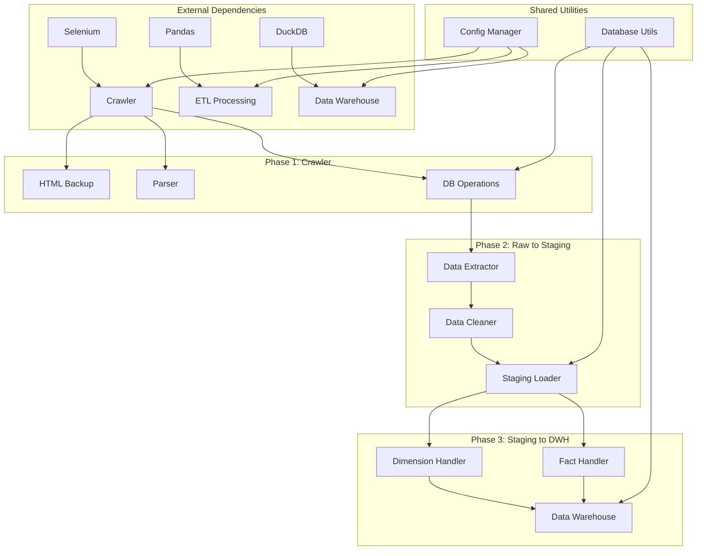

# JobInsight ETL Pipeline - Project Structure Documentation

## Overview

This document provides comprehensive overview của JobInsight ETL Pipeline project structure, codebase organization, và key components. Designed for developers mới, project managers, và stakeholders cần hiểu project layout và dependencies.

## 📁 **Project Directory Structure**

### **Root Level Organization**

```
jobinsight-etl/
├── 📁 src/                          # Source code (3-phase pipeline)
├── 📁 dags/                         # Airflow DAG definitions
├── 📁 sql/                          # Database schemas & queries
├── 📁 data/                         # Data storage & backups
├── 📁 docs/                         # Documentation (this file)
├── 📁 tests/                        # Unit & integration tests
├── 📁 logs/                         # Application logs
├── 📄 requirements.txt              # Python dependencies
├── 📄 docker-compose.yml            # Container orchestration
├── 📄 Dockerfile                    # Docker image definition
├── 📄 env.example                   # Environment variables template
├── 📄 airflow.cfg                   # Airflow configuration
├── 📄 raw_jobs.csv                  # Sample data file
├── 📄 README.md                     # Project overview
└── 📄 LICENSE                       # Project license
```

### **Source Code Structure (`src/`)**

```
src/
├── 📄 __init__.py
│
├── 📁 crawler/                      # Phase 1: Web Crawling
│   ├── 📄 __init__.py
│   ├── 📄 crawler.py                # Main crawler orchestrator
│   ├── 📄 backup_manager.py         # HTML backup (Playwright) + concurrency
│   ├── 📄 captcha_handler.py        # Anti-detection helper
│   ├── 📄 parser.py                 # HTML parsing (BeautifulSoup)
│   ├── 📄 crawler_config.py         # Crawler configuration
│   └── 📄 crawler_utils.py          # Utilities (parse_last_update, etc.)
│
├── 📁 etl/                          # Phase 2 & 3: ETL Processing
│   ├── 📄 __init__.py
│   ├── 📄 etl_main.py               # Staging→DWH ETL helpers (backup, staging batch, integrity)
│   ├── 📄 raw_to_staging.py         # Phase 2: Raw to staging ETL
│   ├── 📄 staging_to_dwh.py         # Phase 3: Staging to DWH ETL (main entry)
│   ├── 📄 dimension_handler.py      # SCD Type 2 processing
│   ├── 📄 fact_handler.py           # Fact table processing
│   ├── 📄 etl_utils.py              # DuckDB setup, batch utilities
│   └── 📄 partitioning.py           # Parquet partition mgmt
│
├── 📁 db/                           # Database operations
│   ├── 📄 __init__.py
│   ├── 📄 core.py                   # Core database functions
│   └── 📄 bulk_operations.py        # Bulk database operations
│
├── 📁 ingestion/                    # Data ingestion utilities
│   ├── 📄 __init__.py
│   ├── 📄 cdc.py                    # Change Data Capture
│   ├── 📄 db_operations_utils.py    # Database operation utilities
│   └── 📄 path_utils.py             # Path management utilities
│
├── 📁 processing/                   # Data processing utilities
│   ├── 📄 __init__.py
│   ├── 📄 data_prepare.py           # Data preparation functions
│   └── 📄 data_processing.py        # Data processing logic
│
├── 📁 common/                       # Common utilities
│   ├── 📄 __init__.py
│   └── 📄 decorators.py             # Common decorators
│
└── 📁 utils/                        # General utilities
    ├── 📄 __init__.py
    ├── 📄 cleanup.py                # Cleanup utilities
    ├── 📄 config.py                 # Configuration management
    ├── 📄 db.py                     # Database utilities
    ├── 📄 etl_validator.py          # ETL validation
    ├── 📄 logger.py                 # Logging utilities
    ├── 📄 path_helpers.py           # Path helper functions
    ├── 📄 retry.py                  # Retry logic
    └── 📄 user_agent_manager.py     # User agent management
```

## 🗄️ **Database & Storage Structure**

### **Data Directory (`data/`)**

```
data/
├── 📁 raw_backup/                   # Phase 1: HTML backup files
│   ├── 📄 it_p1_*.html              # Page 1 HTML backups (timestamped)
│   ├── 📄 it_p2_*.html              # Page 2 HTML backups
│   ├── 📄 it_p3_*.html              # Page 3 HTML backups
│   ├── 📄 it_p4_*.html              # Page 4 HTML backups
│   └── 📄 it_p5_*.html              # Page 5 HTML backups
│
├── 📁 cdc/                          # Change Data Capture logs
│   ├── 📁 202507/                   # July 2025 CDC data
│   └── 📁 202508/                   # August 2025 CDC data
│
├── 📁 duck_db/                      # Phase 3: Data warehouse
│   ├── 📄 jobinsight_warehouse.duckdb # Main DuckDB warehouse file
│   └── 📁 backup/                   # DuckDB backup files
│
└── 📁 parquet/                      # Parquet exports
    └── 📁 FactJobPostingDaily/      # Fact table exports
```

### **SQL Schema Files (`sql/`)**

```
sql/
├── 📄 create_user.sql               # Database user creation scripts
├── 📄 init.sql                      # Database initialization scripts
├── 📄 insert_raw_to_staging.sql     # Phase 2 ETL transformation queries
├── 📄 schema_dwh.sql                # DuckDB data warehouse schema (dimensions + facts)
├── 📄 schema_raw_jobs.sql           # PostgreSQL raw jobs table schema
├── 📄 schema_staging.sql            # PostgreSQL staging schema (jobinsight_staging)
├── 📄 stored_procedures.sql         # Database stored procedures
└── 📄 views.sql                     # Analytical views và reporting queries
```

## ⚙️ **Configuration Management**

### **Environment Configuration**

Configuration is managed through environment variables và configuration files embedded trong source code:

| Category | Variables | Purpose | Location |
|----------|-----------|---------|----------|
| **Database** | `DB_HOST, DB_PORT, DB_USER, DB_PASSWORD, DB_NAME`, `DUCKDB_PATH` | Database connections | `env.example`, src/utils/config.py |
| **Crawler** | `CRAWLER_DELAY_MIN`, `CRAWLER_MAX_PAGES` | Crawling behavior | `src/crawler/crawler_config.py` |
| **ETL** | `ETL_BATCH_SIZE`, `ETL_LAST_DATE` | Processing control | `src/utils/config.py` |
| **Monitoring** | `LOG_LEVEL`, `ALERT_THRESHOLDS` | Observability | `src/utils/logger.py` |

## 🔧 **Key Components & Dependencies**

### **Phase 1: Crawler Components**

| Component | File | Purpose | Dependencies |
|-----------|------|---------|--------------|
| **Crawler** | `crawler.py` | Main crawler implementation | Selenium, BeautifulSoup |
| **BackupManager** | `backup_manager.py` | HTML backup management | File I/O, threading |
| **CaptchaHandler** | `captcha_handler.py` | Anti-detection logic | Custom algorithms |
| **Parser** | `parser.py` | HTML parsing & extraction | Pandas, RegEx |
| **BulkOperations** | `../db/bulk_operations.py` | High-performance DB ops (bulk upsert to PostgreSQL) | psycopg2, SQLAlchemy |

### **Phase 2: ETL Components**

| Component | File | Purpose | Dependencies |
|-----------|------|---------|--------------|
| **RawToStaging** | `raw_to_staging.py` | Raw to staging ETL | PostgreSQL, Pandas, SQLAlchemy |
| **DataPrepare** | `../processing/data_prepare.py` | Data preparation functions | Pandas, text processing |
| **CDC** | `../ingestion/cdc.py` | Change Data Capture | Database triggers |
| **ETLUtils** | `etl_utils.py` | DuckDB connection/setup + batch insert | duckdb, pandas |

### **Phase 3: DWH Components**

| Component | File | Purpose | Dependencies |
|-----------|------|---------|--------------|
| **StagingToDWH** | `staging_to_dwh.py` | Staging to DWH ETL | DuckDB, PostgreSQL, Pandas |
| **DimensionHandler** | `dimension_handler.py` | SCD Type 2 processing | DuckDB, Pandas |
| **FactHandler** | `fact_handler.py` | Fact table generation | DuckDB, date utilities |
| **ETLValidator** | `../utils/etl_validator.py` | Data quality validation | Pandas, validation rules |

## 🚀 **Deployment & Operations**

### **Airflow DAGs (`dags/`)**

```
dags/
├── 📄 crawl_jobs.py                 # Job crawling DAG (Phase 1)
└── 📄 etl_pipeline.py               # ETL pipeline DAG (Phase 2 & 3)
```

### **Docker Configuration**

```yaml
# docker-compose.yml structure
services:
  postgres:         # PostgreSQL (Airflow + JobInsight schemas)
  airflow-webserver:
  airflow-scheduler:
  airflow-init:
  grafana:
volumes:
  postgres-db-volume:
  grafana_data:
```

### **Testing Structure (`tests/`)**

```
tests/
├── 📄 test_crawler.py               # Phase 1: Crawler tests
├── 📄 test_ingest.py                # Data ingestion tests
├── 📄 test_raw_staging.py           # Phase 2: Raw to staging tests
└── 📄 test_staging_to_dwh.py        # Phase 3: Staging to DWH tests
```

## 📊 **Module Dependencies & Relationships**

### **Dependency Graph**



### **Import Relationships**

| Module | Imports From | Exports To | Purpose |
|--------|--------------|------------|---------|
| **crawler_main** | All crawler modules | Airflow DAG | Orchestration |
| **etl_main** | ETL modules + utils | Airflow DAG | ETL coordination |
| **database_utils** | SQLAlchemy, psycopg2 | All data modules | DB abstraction |
| **config_manager** | YAML, ENV | All modules | Configuration |
| **data_prepare** | Pandas, utils | ETL modules | Data transformation |

## 🔍 **Development Workflow**

### **Getting Started**

1. **Environment Setup**
   ```bash
   git clone <repository>
   cd jobinsight-etl
   cp .env.example .env
   pip install -r requirements.txt
   ```

2. **Database Setup**
   ```bash
   # PostgreSQL (Phase 1 & 2)
   docker run -d -p 5432:5432 -e POSTGRES_DB=jobinsight postgres
   
   # Initialize schemas
   python scripts/setup_databases.py
   ```

3. **Run Pipeline**
   ```bash
   # Full pipeline via Airflow DAGs
   # Or run individual phases:
   python -m src.crawler.crawler
   python -m src.etl.raw_to_staging
   python -m src.etl.staging_to_dwh
   ```

### **Development Guidelines**

- **Code Style**: PEP 8 compliance, type hints encouraged
- **Testing**: Unit tests available trong tests/ directory
- **Documentation**: Docstrings for all public functions
- **Configuration**: Environment variables for all settings
- **Logging**: Structured logging với appropriate levels

### **Key Integration Points**

| Integration | Trigger | Data Flow | Monitoring |
|-------------|---------|-----------|------------|
| **Web → Phase 1** | Scheduled | HTML → PostgreSQL | Success rate tracking |
| **Phase 1 → Phase 2** | SQL ETL | PostgreSQL → PostgreSQL | Batch processing |
| **Phase 2 → Phase 3** | ETL trigger | PostgreSQL → DuckDB | Data quality checks |
| **Phase 3 → Analytics** | Query-based | DuckDB → BI tools | Performance monitoring |

---

*For detailed implementation guides:*
- *[System Architecture Overview](System_Architecture_Overview.md)*
- *[Phase 1: Crawler Documentation](crawler/README.md)*
- *[Phase 2: Raw to Staging ETL](etl-raw-to-staging/README.md)*
- *[Phase 3: Staging to DWH ETL](etl-staging-to-dwh/README.md)*
- *[Development Setup Guide](../README.md)*
