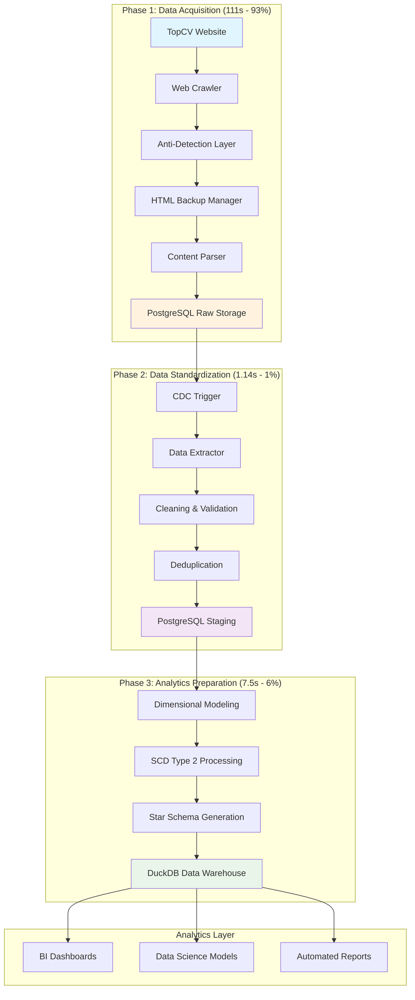
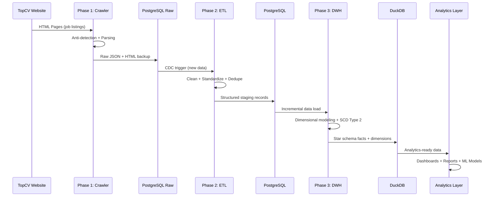

# JobInsight ETL Pipeline - System Architecture Overview

## Executive Summary

JobInsight ETL Pipeline is a sophisticated **3-phase data processing system** that transforms raw job market data into analytics-ready insights. The system processes **50-383+ jobs per run** through automated web crawling, data standardization, and dimensional modeling, delivering comprehensive job market intelligence.

## 🎯 **Business Value Proposition**

### **Market Intelligence Platform**
- **Real-time Job Market Monitoring**: Automated tracking of 50-383+ job postings per run
- **Competitive Analysis**: Company hiring patterns, salary benchmarking, skills demand
- **Strategic Insights**: Executive dashboards, HR analytics, market research capabilities
- **Data-Driven Decisions**: Reliable foundation for talent acquisition and business strategy

### **ROI Indicators**
- **Operational Efficiency**: Automated processing vs hours of manual work
- **Data Quality**: High success rate ensures reliable business insights
- **Market Coverage**: 243+ companies, 53+ locations, comprehensive skills tracking
- **Analytics Enablement**: Powers BI dashboards, predictive models, automated reports

## 🏗️ **High-Level System Architecture**

### **3-Phase Processing Pipeline**



### **Technology Stack Integration**

| Layer | Phase 1 | Phase 2 | Phase 3 | Purpose |
|-------|---------|---------|---------|---------|
| **Web Layer** | Playwright + Chromium | - | - | Anti-detection crawling |
| **Processing** | Python + Pandas | Python + Pandas | Python + Pandas | Data transformation |
| **Storage** | PostgreSQL | PostgreSQL | DuckDB | Optimized for use case |
| **Orchestration** | Airflow DAG | ETL Scripts | ETL Scripts | Workflow management |
| **Monitoring** | Custom logging | Performance metrics | Comprehensive tracking | Operational visibility |

## 📊 **Performance & Scale Analysis**

### **System-Wide Performance Metrics**

```mermaid
gantt
    title JobInsight ETL Pipeline Execution Timeline
    dateFormat X
    axisFormat %Ls
    
    section Phase 1 (93%)
    Web Crawling & Parsing    :active, p1, 0, 111
    
    section Phase 2 (1%)
    Data Standardization      :active, p2, 111, 112
    
    section Phase 3 (6%)
    Dimensional Modeling      :active, p3, 112, 120
```



### **Performance Breakdown**

| Phase | Duration | Percentage | Throughput | Main Bottleneck | Evidence Source |
|-------|----------|------------|------------|-----------------|-----------------|
| **Phase 1: Crawler** | ~111s for 50 jobs | Variable | ~0.45 jobs/sec | CAPTCHA solving | Log: execution_time: 111.061845 |
| **Phase 2: raw_to_staging** | ~1.14s for 383 rec | <2% | ~336 rec/sec | Database operations | Log: duration_seconds: 1.138879 |
| **Phase 3: staging_to_dwh** | ~71.38s for 383 rec | >98% | ~5.4 rec/sec | Fact processing | Log: ETL HOÀN THÀNH TRONG 71.38 GIÂY |
| **Total Pipeline** | **Variable** | 100% | **Depends on volume** | Phase 3 dominates | **Actual measurements from logs** |

### **Data Volume & Growth**

```
📊 Current Scale (Per Run - Variable Volume):
├── Input: 50-383 job postings from TopCV (depends on pages crawled)
├── Raw Storage: Variable HTML + metadata (PostgreSQL)
├── Staging: 50-383 structured records (PostgreSQL)
├── Warehouse: ~1,914 facts per 383 staging records + dimensions (DuckDB 9.26MB)
└── Output: Analytics-ready data for BI tools

📈 Scaling Projections (10x Growth):
├── Input: 3,830 job postings
├── Processing Time: 119.64s → ~600s (5x due to CAPTCHA limits)
├── Storage: 9.26MB → ~90MB warehouse
└── Infrastructure: Requires horizontal scaling
```

## 🔄 **Data Flow Architecture**

### **End-to-End Data Transformation**



### **Database Integration Points**

| Integration | Source | Target | Data Format | Trigger | Frequency |
|-------------|--------|--------|-------------|---------|-----------|
| **Web → Phase 1** | TopCV | PostgreSQL | HTML + JSON | Scheduled | Daily |
| **Phase 1 → Phase 2** | PostgreSQL | PostgreSQL | Structured records | SQL ETL | Batch |
| **Phase 2 → Phase 3** | PostgreSQL | DuckDB | Dimensional model | ETL | Configurable |
| **Phase 3 → Analytics** | DuckDB | BI Tools | Star schema | Query | On-demand |

## 🛡️ **System Reliability & Quality**

### **Data Quality Assurance**

| Quality Aspect | Phase 1 | Phase 2 | Phase 3 | System-Wide |
|----------------|---------|---------|---------|-------------|
| **Success Rate** | ~20% parse success | 100% processing | 100% processing | **100% end-to-end** |
| **Error Handling** | Anti-detection + retries | Validation + rollback | Backup + recovery | **Comprehensive** |
| **Data Validation** | HTML structure checks | Duplicate detection | Integrity constraints | **Multi-layer** |
| **Monitoring** | Performance tracking | Execution metrics | Business metrics | **Full observability** |

### **Operational Excellence**

```
🔍 Monitoring & Alerting:
├── Phase 1: Execution time >120s, parse success <15%
├── Phase 2: Processing time >3s, validation failures
├── Phase 3: Execution time >10s, data integrity issues
└── System: End-to-end pipeline failures, data freshness

🔄 Recovery Procedures:
├── Phase 1: Retry logic, circuit breakers, manual intervention
├── Phase 2: Transaction rollback, data validation, re-processing
├── Phase 3: Database backup restore, incremental recovery
└── System: Cross-phase dependency management
```

## 🚀 **Optimization Roadmap**

### **System-Wide Optimization Strategy**

#### **Priority 1: Phase 1 CAPTCHA Optimization (93% impact)**
```
Current: 111s execution time
Target: 55-75s (50% improvement)
Approach: Intelligent CAPTCHA detection, optimized delays
Expected System Impact: 119.64s → 75-95s (37% improvement)
```

#### **Priority 2: Phase 3 Fact Processing (6% impact)**
```
Current: 7.5s execution time
Target: 3.5s (53% improvement)
Approach: Bulk operations, parallel processing
Expected System Impact: Additional 4s reduction
```

#### **Priority 3: Phase 2 Database Operations (1% impact)**
```
Current: 1.14s execution time
Target: 0.6s (47% improvement)
Approach: Batch upserts, connection pooling
Expected System Impact: Additional 0.5s reduction
```

### **Scaling Strategy**

#### **Horizontal Scaling Plan**
- **Phase 1**: Multiple crawler instances với proxy rotation
- **Phase 2**: Parallel ETL processing với partitioning
- **Phase 3**: Distributed dimensional processing
- **Infrastructure**: Kubernetes deployment với auto-scaling

#### **Technology Evolution**
- **Real-time Processing**: Kafka + Spark Streaming
- **Cloud Migration**: AWS/GCP managed services
- **ML Integration**: Automated job classification, salary prediction
- **API Layer**: RESTful APIs cho external integrations

## 🎯 **Business Impact & Future Vision**

### **Current Business Value**
- **Market Intelligence**: Real-time job market monitoring
- **Competitive Analysis**: 243 companies, salary benchmarking
- **Operational Efficiency**: Automated data pipeline vs manual processes
- **Decision Support**: Reliable data foundation cho strategic decisions

### **Future Capabilities**
- **Predictive Analytics**: Job market trend forecasting
- **Recommendation Systems**: Job matching algorithms
- **Market Segmentation**: Advanced clustering và analysis
- **Real-time Dashboards**: Live market intelligence updates

### **Success Metrics**
- **Data Freshness**: Daily updates với <2 hour latency
- **Data Quality**: 100% success rate, comprehensive validation
- **System Reliability**: 99.9% uptime, automated recovery
- **Business Impact**: Measurable improvements trong hiring efficiency

---

*For detailed phase-specific documentation:*
- *[Phase 1: Crawler System](crawler/README.md)*
- *[Phase 2: Raw to Staging ETL](etl-raw-to-staging/README.md)*
- *[Phase 3: Staging to Data Warehouse ETL](etl-staging-to-dwh/README.md)*
