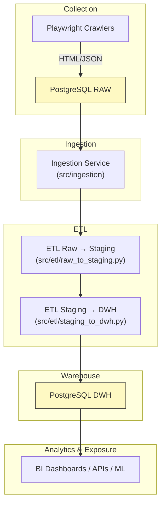

# System Architecture

## Component Breakdown

| Layer | Technology | Description |
|-------|------------|-------------|
| Collection | **Playwright**, Python | Headless browsers scrape job postings from multiple boards; implemented in `src/crawler`. |
| Raw Storage | **PostgreSQL** (`raw_jobs`) | Stores unprocessed crawled data for traceability. |
| Ingestion | Python, SQLAlchemy | Lightweight ingestion service inserts/updates raw table; see `src/ingestion`. |
| Transformation | **pandas**, **SQL** | Modular ETL transforms raw → staging → DWH via `src/etl`. |
| Orchestration | **Apache Airflow** | DAGs `crawl_jobs` & `etl_pipeline` schedule and coordinate tasks. |
| Warehouse | **PostgreSQL** schemas `jobinsight_staging`, default, and DWH tables | Optimised star-schema for analytics. |
| Monitoring | **Airflow UI**, **Grafana**, Logs | Operational visibility and alerting. |

## Airflow DAGs

1. **`crawl_jobs`** – Executes Playwright crawlers and loads `raw_jobs`.
2. **`etl_pipeline`** – Performs cleansing, dimension maintenance, and fact loading.

## Data Flow Chronology
1. **Crawl** – Raw HTML/JSON captured.
2. **Persist** – Raw rows inserted into `raw_jobs`.
3. **Cleanse** – `raw_to_staging` normalises salary, locations, skills.
4. **Load** – `staging_to_dwh` builds SCD-2 dimensions & fact tables.
5. **Visualise** – BI tools query DWH views (`vw_current_jobs`, `vw_top_companies`, ...).

## Scalability Considerations
- Switch to **CeleryExecutor** or **KubernetesExecutor** for scale-out.
- Replace Postgres container with managed service.

## Security Notes
- Use a secrets backend (Vault, AWS Secrets Manager) in production.

## Future Enhancements
- Add streaming ingestion (Kafka) for near real-time updates.
- Provision Grafana dashboards automatically.
