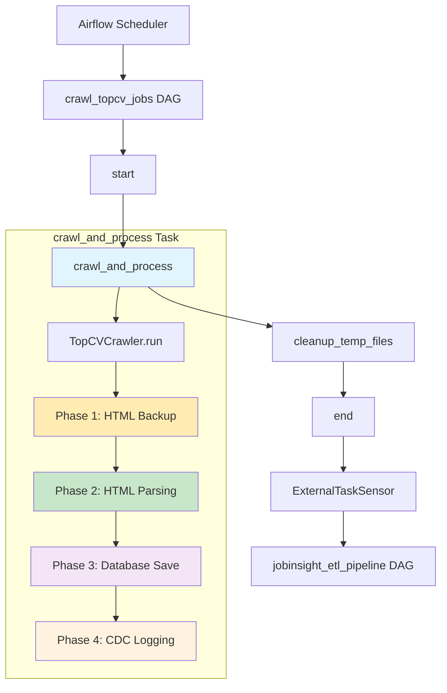
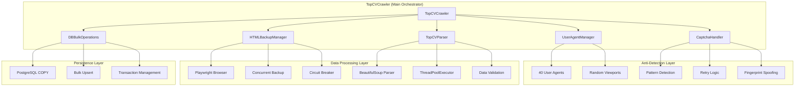
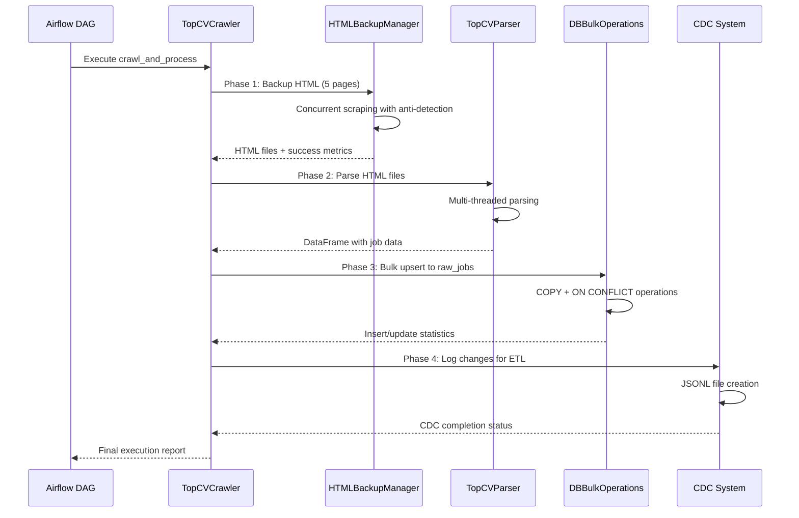

# JobInsight Crawler System - Architecture Overview

## Executive Summary

The JobInsight Crawler System (Phase 1) is a production-ready data acquisition pipeline that autonomously extracts job posting data from TopCV. The system runs daily at 11:00 AM Vietnam time, processing **50+ job postings** with sophisticated anti-detection mechanisms.

## Performance Overview

### 📊 **Production Metrics**
- **Daily Schedule**: 11:00 AM Vietnam time (17:40 UTC)
- **Execution Time**: ~2 minutes average
- **Data Volume**: 50+ job postings per run
- **Success Rate**: Varies based on anti-bot detection

### 🚨 **Operational Considerations**
- **Anti-Detection**: System includes CAPTCHA handling and retry mechanisms
- **Reliability**: Built-in circuit breakers and error recovery
- **Monitoring**: Comprehensive logging for troubleshooting

## System Architecture

### High-Level DAG Structure

### Component Architecture

## Data Flow Architecture

### 4-Phase Processing Pipeline

## Component Responsibilities

### 1. TopCVCrawler (Orchestrator)
- **Purpose**: Central coordinator for entire crawling process
- **Responsibilities**: Pipeline orchestration, error handling, configuration management

### 2. HTMLBackupManager (Web Scraping)
- **Purpose**: Concurrent HTML page backup with anti-detection
- **Responsibilities**: Browser automation, concurrency control, circuit breaker protection

### 3. CaptchaHandler (Anti-Detection)
- **Purpose**: Detect and handle anti-bot measures
- **Responsibilities**: CAPTCHA detection, retry logic, browser fingerprint spoofing

### 4. TopCVParser (Data Extraction)
- **Purpose**: Extract structured data from HTML
- **Responsibilities**: HTML parsing, data validation, concurrent processing

### 5. DBBulkOperations (Data Persistence)
- **Purpose**: High-performance database operations
- **Responsibilities**: Bulk inserts/updates, transaction management, performance optimization

## Configuration Overview

### Key Configuration Areas
- **Execution Settings**: Number of pages, parallel processing, scheduling
- **Anti-Detection**: Delays, user agents, retry logic, circuit breakers
- **Performance**: Timeouts, worker threads, memory management
- **Database**: Connection settings, bulk operation parameters

*For detailed configuration options, see [Configuration Guide](03_configuration_guide.md)*

## Deployment Architecture

### Container Environment
- **Runtime**: Docker container with Python 3.13+
- **Dependencies**: Playwright, BeautifulSoup, psycopg2, pandas
- **Resource Requirements**: 
  - Memory: ~1.2GB during execution
  - CPU: Multi-core for concurrent processing
  - Storage: Temporary HTML files (~5MB per run)

### Integration Points
- **Upstream**: Scheduled execution via Airflow
- **Downstream**: ETL pipeline triggered via ExternalTaskSensor
- **Monitoring**: Structured logging to Airflow logs
- **Alerting**: Task failure notifications through Airflow

## Security & Compliance

### Anti-Detection Measures
- **User-Agent Rotation**: 40 realistic browser signatures
- **Fingerprint Masking**: JavaScript injection to hide automation
- **Behavioral Simulation**: Human-like scrolling and timing
- **IP Rotation**: Circuit breaker to prevent IP bans

### Data Privacy
- **No PII Collection**: Only public job posting data
- **Audit Trail**: CDC system tracks all data changes
- **Retention Policy**: 15-day cleanup for temporary files

## Next Steps

This architecture documentation provides the foundation for understanding the crawler system. For detailed implementation guides, see:
- [Technical Implementation Guide](02_technical_implementation.md)
- [Configuration Guide](03_configuration_guide.md)
- [Performance Analysis](04_performance_analysis.md)
- [Troubleshooting Guide](05_troubleshooting_guide.md)
