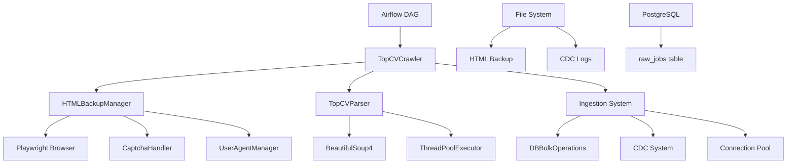
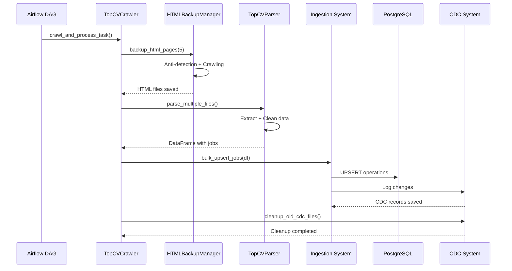

# JobInsight Crawler System Overview

## Table of Contents
1. [System Architecture](#system-architecture)
2. [Core Components](#core-components)
3. [Component Interactions](#component-interactions)
4. [Data Flow Overview](#data-flow-overview)
5. [Configuration Management](#configuration-management)
6. [Performance Characteristics](#performance-characteristics)
7. [Security and Anti-Detection](#security-and-anti-detection)

## System Architecture

The JobInsight Crawler System is a sophisticated web scraping and data ingestion platform designed to collect job posting data from TopCV.vn. The system follows a modular, two-phase architecture that separates HTML backup from data parsing for improved reliability and recovery capabilities.



## Core Components

### 1. TopCVCrawler (Main Orchestrator)
**Location**: `src/crawler/crawler.py`
**Purpose**: Central coordinator for the entire crawling process

**Key Responsibilities**:
- Orchestrates the two-phase crawling process
- Manages component lifecycle and error handling
- Coordinates HTML backup, parsing, and database ingestion
- Implements CDC cleanup to prevent file accumulation

**Configuration**:
```python
config = {
    'num_pages': 5,            # Number of pages to crawl
    'use_parallel': True,      # Enable parallel crawling
    'db_table': 'raw_jobs',    # Target database table
    'concurrent_backups': 3,   # Parallel backup limit
    'enable_cdc': True         # Enable Change Data Capture
}
```

### 2. HTMLBackupManager (Web Scraping Engine)
**Location**: `src/crawler/backup_manager.py`
**Purpose**: Handles HTML page backup with anti-detection measures

**Key Features**:
- Playwright-based browser automation
- Concurrent page crawling with semaphore control
- Anti-detection mechanisms (User-Agent rotation, fingerprint masking)
- Retry logic with exponential backoff
- Captcha detection and handling

**Anti-Detection Measures**:
```python
# User-Agent rotation (70% Desktop, 30% Mobile)
USER_AGENTS = [
    "Mozilla/5.0 (Windows NT 10.0; Win64; x64) AppleWebKit/537.36...",
    "Mozilla/5.0 (iPhone; CPU iPhone OS 17_2 like Mac OS X)...",
    # ... 40+ user agents
]

# Viewport randomization
VIEWPORTS = {
    "desktop": {"width": 1366, "height": 768},
    "mobile": {"width": 390, "height": 844"}
}
```

### 3. TopCVParser (Data Extraction Engine)
**Location**: `src/crawler/parser.py`
**Purpose**: Extracts structured data from HTML files

**Key Features**:
- BeautifulSoup4-based HTML parsing
- Thread-safe concurrent processing
- Memory leak prevention (critical fix implemented)
- Data validation and cleaning
- Duplicate detection and removal

**Memory Management** (Fixed):
```python
def parse_multiple_files(self):
    # CRITICAL FIX: Clear processed job IDs set
    with self._job_data_lock:
        old_size = len(self._job_id_processed)
        self._job_id_processed.clear()
        logger.debug(f"Cleared {old_size} processed job IDs")
```

### 4. CaptchaHandler (Anti-Block System)
**Location**: `src/crawler/captcha_handler.py`
**Purpose**: Detects and handles captcha/blocking scenarios

**Detection Patterns**:
```python
captcha_patterns = [
    r'captcha', r'robot', r'automated\s+access',
    r'unusual\s+traffic', r'suspicious\s+activity',
    r'access\s+denied', r'security\s+check'
]
```

**Handling Strategies**:
- Progressive delay (2s, 5s, 10s)
- Browser fingerprint masking
- Human-like scrolling behavior
- Cookie clearing and rotation

### 5. Ingestion System
**Location**: `src/ingestion/`
**Purpose**: Processes parsed data and stores it in the database

**Components**:
- **data_processor.py**: Data validation and preparation
- **ingest.py**: Main ingestion orchestrator
- **cdc.py**: Change Data Capture logging
- **db_operations.py**: Database interface layer

### 6. Connection Pool Manager (Critical Fix)
**Location**: `src/db/connection_pool.py`
**Purpose**: Manages database connections to prevent leaks

**Features**:
- Singleton pattern for global connection management
- Thread-safe connection pooling (2-10 connections)
- Automatic connection health monitoring
- Graceful connection recovery

## Component Interactions

### Phase 1: HTML Backup
```python
# TopCVCrawler initiates backup
backup_results = await self.backup_manager.backup_html_pages(5, True)

# HTMLBackupManager coordinates:
# 1. User-Agent selection
# 2. Browser launch with anti-detection
# 3. Page navigation and content extraction
# 4. Captcha detection and handling
# 5. HTML file saving with timestamps
```

### Phase 2: Data Parsing
```python
# TopCVParser processes HTML files
df = self.parser.parse_multiple_files()

# Processing includes:
# 1. Memory leak prevention (clear processed set)
# 2. Concurrent file processing
# 3. Data extraction with BeautifulSoup4
# 4. Validation and cleaning
# 5. DataFrame creation with unique jobs
```

### Phase 3: Database Ingestion
```python
# Ingestion system handles data storage
db_result = self.db_ops.bulk_upsert(df, 'raw_jobs')

# Process includes:
# 1. Data preparation and validation
# 2. Connection pool utilization
# 3. Bulk UPSERT operations
# 4. CDC logging for audit trail
# 5. Statistics collection
```

## Data Flow Overview



## Configuration Management

### Environment Variables
```bash
# Database Configuration
DB_HOST=postgres
DB_PORT=5432
DB_USER=jobinsight
DB_PASSWORD=jobinsight
DB_NAME=jobinsight

# Crawler Configuration
CRAWL_DELAY=2
MAX_JOBS_PER_CRAWL=50
CDC_DAYS_TO_KEEP=15

# Airflow Configuration
AIRFLOW__CORE__DEFAULT_TIMEZONE=Asia/Ho_Chi_Minh
```

### Crawler Configuration
```python
# src/crawler/crawler_config.py
BASE_URL = "https://www.topcv.vn/viec-lam-it"
MIN_DELAY_BETWEEN_PAGES = 4
MAX_DELAY_BETWEEN_PAGES = 8
PAGE_LOAD_TIMEOUT = 60000
SELECTOR_TIMEOUT = 20000
MAX_RETRY = 3
```

## Performance Characteristics

### Throughput Metrics
- **Pages per minute**: 5-8 pages (with anti-detection delays)
- **Jobs per page**: 20-25 jobs average
- **Total jobs per run**: 100-125 jobs
- **Execution time**: 45-60 seconds per crawl session

### Resource Usage
- **Memory**: 50-100MB baseline (after memory leak fix)
- **Database connections**: 2-10 pooled connections (after connection pool fix)
- **Disk space**: 10-50MB per day (after CDC cleanup fix)
- **CPU**: 10-30% during active crawling

### Scalability Limits
- **Concurrent pages**: Limited to 3 for anti-detection
- **Database throughput**: 1000+ records/second with bulk operations
- **File I/O**: Limited by disk speed for HTML backup

## Security and Anti-Detection

### Anti-Detection Strategies
1. **User-Agent Rotation**: 40+ realistic user agents
2. **Viewport Randomization**: Desktop and mobile viewports
3. **Request Timing**: Random delays between requests
4. **Browser Fingerprinting**: Masked webdriver properties
5. **Human Behavior**: Scrolling and interaction simulation

### Security Measures
1. **Connection Encryption**: HTTPS for all requests
2. **Error Handling**: Graceful failure without data exposure
3. **Logging**: Structured logging without sensitive data
4. **Access Control**: Database credentials via environment variables

### Rate Limiting
```python
# Adaptive delays based on response
MIN_DELAY = 4  # seconds
MAX_DELAY = 8  # seconds
RETRY_DELAYS = [2, 4, 8]  # exponential backoff
```

## Monitoring and Health Checks

### Key Metrics to Monitor
- Success rate of HTML backup operations
- Number of jobs parsed per session
- Database operation success rate
- CDC file growth and cleanup effectiveness
- Memory usage trends
- Connection pool utilization

### Health Check Endpoints
```python
# Connection pool health
pool_stats = get_pool_stats()
# Returns: status, available_connections, used_connections

# Crawler health
health = crawler.health_check()
# Returns: boolean indicating system health
```

## Troubleshooting Quick Reference

### Common Issues
1. **Memory Growth**: Check parser memory leak fix implementation
2. **Connection Timeouts**: Verify connection pool configuration
3. **Captcha Blocks**: Review anti-detection measures
4. **Disk Space**: Check CDC cleanup functionality
5. **Parse Failures**: Validate HTML structure changes

### Log Locations
- **Airflow Logs**: `/opt/airflow/logs/`
- **Application Logs**: Structured JSON logging to stdout
- **CDC Logs**: `data/cdc/YYYYMMDD/`
- **HTML Backup**: `data/raw_backup/`

---

*This document provides a comprehensive overview of the JobInsight Crawler System architecture. For detailed implementation guides, refer to the specific component documentation files.*
