# DAG crawl_topcv_jobs Guide

## Table of Contents
1. [DAG Overview](#dag-overview)
2. [Task Flow and Dependencies](#task-flow-and-dependencies)
3. [Task Detailed Documentation](#task-detailed-documentation)
4. [Configuration and Parameters](#configuration-and-parameters)
5. [Scheduling and Timing](#scheduling-and-timing)
6. [Monitoring and Logging](#monitoring-and-logging)
7. [Troubleshooting Guide](#troubleshooting-guide)
8. [Performance Optimization](#performance-optimization)

## DAG Overview

The `crawl_topcv_jobs` DAG is the primary data collection pipeline for the JobInsight system. It orchestrates the complete process of crawling job data from TopCV.vn, parsing the content, and storing it in the database with comprehensive change tracking.

**File Location**: `dags/crawl_jobs.py`
**DAG ID**: `crawl_topcv_jobs`
**Schedule**: Daily at 11:00 UTC (18:00 Vietnam time)

### DAG Configuration
```python
dag = DAG(
    'crawl_topcv_jobs',
    default_args=default_args,
    description='Crawl job data from TopCV and ingest to database',
    schedule_interval='0 11 * * *',
    start_date=datetime(2023, 10, 1),
    catchup=False,
    tags=['jobinsight', 'crawler', 'etl'],
)
```

### Default Arguments
```python
default_args = {
    'owner': 'airflow',
    'depends_on_past': False,
    'email_on_failure': False,
    'email_on_retry': False,
    'retries': 2,
    'retry_delay': timedelta(minutes=2),
}
```

## Task Flow and Dependencies


### Task Dependencies
```python
# Task execution order
start >> crawl_and_process >> cleanup_temp_files >> end
```

## Task Detailed Documentation

### Task 1: `start` (DummyOperator)
**Purpose**: Symbolic start point for the DAG
**Duration**: Instant
**Dependencies**: None

```python
start = DummyOperator(task_id='start')
```

### Task 2: `crawl_and_process` (PythonOperator)
**Purpose**: Main crawling and data processing task
**Function**: `crawl_and_process_task()`
**Expected Duration**: 45-60 seconds
**Dependencies**: `start`

#### Function Implementation
```python
def crawl_and_process_task(**kwargs):
    """
    Executes the complete crawling process using TopCVCrawler
    """
    config = {
        'num_pages': 5,
        'use_parallel': True,
        'db_table': 'raw_jobs',
        'concurrent_backups': 3,
    }
    
    result = TopCVCrawler.run(config=config)
    
    if not result['success']:
        raise Exception(f"Crawler failed: {result.get('error')}")
    
    return result
```

#### Expected Output Structure
```python
{
    'success': True,
    'execution_time': 45.67,
    'backup': {
        'successful': 5,
        'total': 5,
        'failed': 0,
        'filenames': ['topcv_page_1_20250108_110000.html', ...]
    },
    'parse': {
        'total_jobs': 125,
        'company_count': 89,
        'location_count': 15,
        'top_skills': ['Python', 'Java', 'React']
    },
    'database': {
        'inserted': 45,
        'updated': 80,
        'total_processed': 125
    },
    'cdc': {
        'inserted': 45,
        'updated': 80,
        'failed': 0
    },
    'cdc_cleanup': {
        'files_removed': 12,
        'bytes_freed': 1048576
    }
}
```

#### Internal Process Flow
1. **HTML Backup Phase** (15-20 seconds)
   - Launch Playwright browsers with anti-detection
   - Crawl 5 pages concurrently (max 3 parallel)
   - Save HTML files to `data/raw_backup/`
   - Handle captcha detection and retry logic

2. **Data Parsing Phase** (10-15 seconds)
   - Parse HTML files with BeautifulSoup4
   - Extract job data using CSS selectors
   - Clean and validate data
   - Create pandas DataFrame with unique jobs

3. **Database Ingestion Phase** (10-15 seconds)
   - Prepare data for database insertion
   - Execute bulk UPSERT operations
   - Log changes to CDC system
   - Return operation statistics

4. **CDC Cleanup Phase** (2-5 seconds)
   - Remove CDC files older than 15 days
   - Clean empty directories
   - Report cleanup statistics

### Task 3: `cleanup_temp_files` (PythonOperator)
**Purpose**: Clean up temporary files to prevent disk space issues
**Function**: `cleanup_temp_files_task(days_to_keep=15)`
**Expected Duration**: 2-5 seconds
**Dependencies**: `crawl_and_process`

#### Function Implementation
```python
def cleanup_temp_files_task(days_to_keep=15, **kwargs):
    """
    Clean up HTML backup and CDC files older than specified days
    """
    cleanup_results = cleanup_all_temp_files(
        html_days_to_keep=days_to_keep,
        cdc_days_to_keep=days_to_keep
    )
    
    stats = {
        'cdc': {'files_removed': cleanup_results.get('cdc_files', 0)},
        'html': {'files_removed': cleanup_results.get('html_files', 0)},
        'total_files_removed': cleanup_results.get('total', 0),
        'execution_time': execution_time,
    }
    
    return stats
```

#### Cleanup Targets
- **HTML Backup Files**: `data/raw_backup/*.html` older than 15 days
- **CDC Log Files**: `data/cdc/YYYYMMDD/*.json` older than 15 days
- **Empty Directories**: Remove empty date directories

### Task 4: `end` (DummyOperator)
**Purpose**: Symbolic end point for the DAG
**Duration**: Instant
**Dependencies**: `cleanup_temp_files`

```python
end = DummyOperator(task_id='end')
```

## Configuration and Parameters

### Environment Variables
```bash
# Required for crawler operation
DB_HOST=postgres
DB_PORT=5432
DB_USER=jobinsight
DB_PASSWORD=jobinsight
DB_NAME=jobinsight

# Optional crawler tuning
CRAWL_DELAY=2
MAX_JOBS_PER_CRAWL=50
CDC_DAYS_TO_KEEP=15
```

### Crawler Configuration
```python
# Configurable parameters in crawl_and_process_task
config = {
    'num_pages': 5,            # Number of TopCV pages to crawl
    'use_parallel': True,      # Enable parallel page crawling
    'db_table': 'raw_jobs',    # Target database table
    'concurrent_backups': 3,   # Max parallel browser instances
    'enable_cdc': True,        # Enable Change Data Capture
}
```

### Cleanup Configuration
```python
# Configurable parameters in cleanup_temp_files_task
cleanup_params = {
    'days_to_keep': 15,        # Days to retain files
    'html_days_to_keep': 15,   # HTML file retention
    'cdc_days_to_keep': 15,    # CDC file retention
}
```

## Scheduling and Timing

### Schedule Configuration
- **Cron Expression**: `0 11 * * *`
- **Timezone**: UTC (configured in docker-compose.yml)
- **Local Time**: 18:00 Vietnam time (Asia/Ho_Chi_Minh)
- **Frequency**: Daily
- **Catchup**: Disabled (`catchup=False`)

### Integration with ETL Pipeline

```mermaid
flowchart TD
    A["🕐 11:00 UTC<br/>crawl_topcv_jobs starts"] --> B["HTML backup<br/>(15-20s)"]
    B --> C["Data parsing<br/>(10-15s)"]
    C --> D["Database ingestion<br/>(10-15s)"]
    D --> E["CDC cleanup<br/>(2-5s)"]
    E --> F["🕐 11:01 UTC<br/>crawl_topcv_jobs completes"]

    F --> G["⏳ Wait 29 minutes"]
    G --> H["🕐 11:30 UTC<br/>jobinsight_etl_pipeline starts"]
    H --> I["Wait for crawl completion<br/>(ExternalTaskSensor)"]
    I --> J["Process raw_jobs → staging → DWH"]

    style A fill:#e1f5fe
    style F fill:#c8e6c9
    style H fill:#fff3e0
    style J fill:#f3e5f5
```


### Retry Configuration
- **Max Retries**: 2
- **Retry Delay**: 2 minutes
- **Retry Strategy**: Linear (not exponential)

## Monitoring and Logging

### Key Metrics to Monitor
1. **Task Success Rate**: Should be >95%
2. **Execution Time**: Normal range 45-60 seconds
3. **Jobs Collected**: Expected 100-125 jobs per run
4. **Database Operations**: Insert/Update ratio
5. **File Cleanup**: Disk space management

### Log Locations
```bash
# Airflow task logs
/opt/airflow/logs/crawl_topcv_jobs/crawl_and_process/2025-01-08T11:00:00+00:00/

# Application logs (structured JSON)
# Available in Airflow UI task logs

# CDC logs
data/cdc/20250108/cdc_20250108_110000.json

# HTML backup files
data/raw_backup/topcv_page_1_20250108_110000.html
```

### Log Analysis Examples
```bash
# Check recent DAG runs
airflow dags list-runs -d crawl_topcv_jobs --limit 10

# View specific task logs
airflow tasks logs crawl_topcv_jobs crawl_and_process 2025-01-08T11:00:00+00:00

# Monitor file growth
du -sh data/raw_backup/ data/cdc/
```

## Troubleshooting Guide

### Common Issues and Solutions

#### 1. Crawler Task Failures
**Symptoms**: `crawl_and_process` task fails
**Common Causes**:
- TopCV website blocking/captcha
- Network connectivity issues
- Database connection problems
- Memory exhaustion

**Diagnostic Steps**:
```python
# Check crawler logs for specific error
# Look for these patterns:
"Crawler failed: No successful backups"  # Website blocking
"Database connection failed"             # DB issues
"Memory stats - Processed IDs"          # Memory tracking
```

**Solutions**:
```bash
# For website blocking
# Check anti-detection measures in logs
# Verify user-agent rotation is working

# For database issues
# Check connection pool status
# Verify database credentials

# For memory issues
# Confirm memory leak fix is active
# Monitor memory usage trends
```

#### 2. Cleanup Task Failures
**Symptoms**: `cleanup_temp_files` task fails
**Common Causes**:
- Disk permission issues
- File system full
- Concurrent file access

**Diagnostic Steps**:
```bash
# Check disk space
df -h

# Check file permissions
ls -la data/raw_backup/ data/cdc/

# Check for file locks
lsof +D data/
```

#### 3. Performance Issues
**Symptoms**: Tasks taking longer than expected
**Common Causes**:
- Network latency
- Database performance
- Resource contention

**Performance Monitoring**:
```python
# Monitor execution times
# Normal ranges:
# crawl_and_process: 45-60 seconds
# cleanup_temp_files: 2-5 seconds

# Check resource usage
# Memory: <100MB
# CPU: <30% during crawling
# Disk I/O: Moderate during file operations
```

### Error Recovery Procedures

#### Automatic Recovery
- **Retry Logic**: 2 retries with 2-minute delays
- **Graceful Degradation**: Partial failures don't stop entire process
- **CDC Recovery**: Failed CDC writes are logged but don't fail the task

#### Manual Recovery
```bash
# Restart failed DAG run
airflow dags trigger crawl_topcv_jobs

# Clear failed task and retry
airflow tasks clear crawl_topcv_jobs crawl_and_process -s 2025-01-08T11:00:00

# Manual cleanup if needed
python -c "from src.utils.cleanup import cleanup_all_temp_files; cleanup_all_temp_files()"
```

## Performance Optimization

### Current Performance Characteristics
- **Throughput**: 100-125 jobs per 60-second session
- **Efficiency**: ~2 jobs per second during active parsing
- **Resource Usage**: Optimized after critical fixes

### Optimization Opportunities
1. **Increase Parallelism**: Adjust `concurrent_backups` (currently 3)
2. **Batch Size Tuning**: Optimize database batch operations
3. **Caching**: Implement intelligent HTML caching
4. **Compression**: Compress stored HTML files

### Performance Monitoring Queries
```sql
-- Monitor daily job collection trends
SELECT 
    DATE(crawled_at) as crawl_date,
    COUNT(*) as jobs_collected,
    COUNT(DISTINCT company_name) as unique_companies
FROM raw_jobs 
WHERE crawled_at >= NOW() - INTERVAL '30 days'
GROUP BY DATE(crawled_at)
ORDER BY crawl_date DESC;

-- Check for data quality issues
SELECT 
    COUNT(*) as total_jobs,
    COUNT(CASE WHEN title IS NULL THEN 1 END) as missing_titles,
    COUNT(CASE WHEN company_name IS NULL THEN 1 END) as missing_companies
FROM raw_jobs 
WHERE DATE(crawled_at) = CURRENT_DATE;
```

---

*This guide provides comprehensive documentation for the crawl_topcv_jobs DAG. For system-wide architecture information, refer to the crawler_system_overview.md documentation.*
