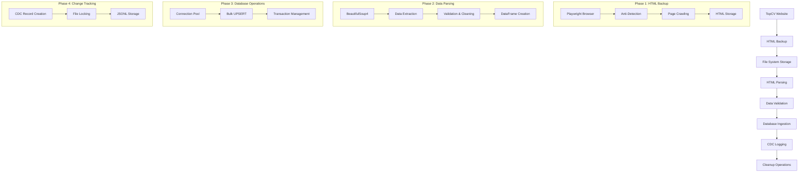

# Data Flow Documentation

## Table of Contents
1. [Data Flow Overview](#data-flow-overview)
2. [Phase 1: HTML Backup](#phase-1-html-backup)
3. [Phase 2: Data Parsing](#phase-2-data-parsing)
4. [Phase 3: Database Ingestion](#phase-3-database-ingestion)
5. [Phase 4: CDC Logging](#phase-4-cdc-logging)
6. [Phase 5: Cleanup Operations](#phase-5-cleanup-operations)
7. [Data Formats and Schemas](#data-formats-and-schemas)
8. [Error Handling in Data Flow](#error-handling-in-data-flow)
9. [Data Quality Assurance](#data-quality-assurance)

## Data Flow Overview

The JobInsight crawler system implements a comprehensive five-phase data flow that ensures reliable data collection, processing, and storage with full audit capabilities.



## Phase 1: HTML Backup

### Purpose
Backup HTML pages from TopCV.vn with anti-detection measures to ensure reliable data collection and enable recovery from parsing failures.

### Input
- **Source**: TopCV job listing pages
- **URL Pattern**: `https://www.topcv.vn/viec-lam-it?page={page_num}`
- **Pages**: 5 pages per crawl session

### Process Flow
```python
# 1. Browser Initialization
async with async_playwright() as p:
    browser = await p.chromium.launch(headless=True)
    context = await browser.new_context(
        user_agent=random_user_agent,
        viewport=random_viewport
    )

# 2. Anti-Detection Setup
await captcha_handler.apply_anti_detection(page)

# 3. Page Navigation
await page.goto(url, timeout=60000)
await page.wait_for_selector('.job-item-2', timeout=20000)

# 4. Content Extraction
html_content = await page.content()

# 5. Captcha Detection
if captcha_handler.detect_captcha(html_content):
    success, info = await captcha_handler.handle_captcha(page)
```

### Output
- **Location**: `data/raw_backup/`
- **File Format**: HTML files with timestamp
- **Naming Convention**: `topcv_page_{page_num}_{timestamp}.html`
- **Example**: `topcv_page_1_20250108_110000.html`

### File Structure Example
```html
<!DOCTYPE html>
<html>
<body>
    <div class="job-item-2" data-job-id="12345">
        <h3 class="title">
            <a href="/job/12345">
                <span data-original-title="Senior Python Developer">Senior Python Developer</span>
            </a>
        </h3>
        <div class="company">Tech Corp Vietnam</div>
        <div class="salary">20-30 triệu</div>
        <div class="skill-tag">Python</div>
        <div class="skill-tag">Django</div>
        <div class="location">Hà Nội</div>
        <div class="deadline">Hạn nộp: 15/02/2025</div>
    </div>
    <!-- More job items... -->
</body>
</html>
```

### Success Metrics
- **Target**: 5 pages successfully backed up
- **Typical Success Rate**: 95-100%
- **Retry Logic**: Up to 3 retries with exponential backoff
- **Timeout Handling**: 60-second page load timeout

## Phase 2: Data Parsing

### Purpose
Extract structured job data from HTML files using BeautifulSoup4 with concurrent processing and memory management.

### Input
- **Source**: HTML files from Phase 1
- **Format**: Raw HTML content
- **Processing**: Thread-safe concurrent parsing

### Process Flow
```python
# 1. Memory Management (Critical Fix)
with self._job_data_lock:
    old_size = len(self._job_id_processed)
    self._job_id_processed.clear()  # Prevent memory leak

# 2. Concurrent Processing
with ThreadPoolExecutor(max_workers=self.max_workers) as executor:
    future_to_file = {
        executor.submit(self.parse_single_file, html_file): html_file 
        for html_file in html_files
    }

# 3. Data Extraction per Job
def extract_job_data(self, job_item):
    job_data = {
        'job_id': job_item.get('data-job-id'),
        'title': self._extract_title(job_item),
        'company_name': self._extract_company(job_item),
        'salary': self._extract_salary(job_item),
        'skills': self._extract_skills(job_item),
        'location': self._extract_location(job_item),
        'deadline': self._extract_deadline(job_item),
        'verified_employer': self._check_verified(job_item),
        'crawled_at': datetime.now().isoformat()
    }
```

### Data Extraction Rules
```python
# Title Extraction
title_element = job_item.select_one('h3.title span[data-original-title]')
title = title_element.get('data-original-title') if title_element else None

# Company Extraction
company_element = job_item.select_one('.company')
company_name = company_element.get_text(strip=True) if company_element else None

# Skills Extraction
skill_elements = job_item.select('.skill-tag')
skills = [skill.get_text(strip=True) for skill in skill_elements]

# Salary Extraction with Normalization
salary_element = job_item.select_one('.salary')
salary_text = salary_element.get_text(strip=True) if salary_element else None
# Normalize: "20-30 triệu" → "20-30 triệu"
```

### Output
- **Format**: pandas DataFrame
- **Deduplication**: Based on `job_id`
- **Validation**: UTF-8 encoding, required fields
- **Schema**: Matches `raw_jobs` table structure

### DataFrame Schema
```python
df_columns = [
    'job_id',           # Primary key
    'title',            # Job title
    'job_url',          # Full job URL
    'company_name',     # Company name
    'company_url',      # Company profile URL
    'salary',           # Salary range
    'skills',           # JSON array of skills
    'location',         # Job location
    'location_detail',  # Detailed location
    'deadline',         # Application deadline
    'verified_employer', # Boolean flag
    'last_update',      # Last update timestamp
    'logo_url',         # Company logo URL
    'posted_time',      # Job posting time
    'crawled_at'        # Crawl timestamp
]
```

## Phase 3: Database Ingestion

### Purpose
Store parsed job data in PostgreSQL with bulk operations and connection pooling for optimal performance.

### Input
- **Source**: pandas DataFrame from Phase 2
- **Records**: 100-125 jobs per session
- **Format**: Structured job data

### Process Flow
```python
# 1. Data Preparation
prepared_records = []
for _, row in df.iterrows():
    prepared_data = prepare_job_data(row)
    prepared_records.append(prepared_data)

# 2. Connection Pool Usage (Critical Fix)
with get_pooled_connection() as conn:
    with conn.cursor() as cur:
        # 3. Bulk UPSERT Operation
        upsert_query = """
        INSERT INTO raw_jobs (job_id, title, company_name, ...)
        VALUES %s
        ON CONFLICT (job_id) 
        DO UPDATE SET 
            title = EXCLUDED.title,
            company_name = EXCLUDED.company_name,
            last_update = EXCLUDED.crawled_at,
            ...
        """
        execute_values(cur, upsert_query, values_list)
```

### Data Preparation Steps
```python
def prepare_job_data(row: pd.Series) -> Dict[str, Any]:
    # 1. UTF-8 Validation
    data = {
        'job_id': str(row['job_id']),
        'title': validate_utf8(row.get('title')),
        'company_name': validate_utf8(row.get('company_name')),
    }
    
    # 2. Skills Processing
    skills = row.get('skills', [])
    if isinstance(skills, str):
        skills = json.loads(skills)
    data['skills'] = [validate_utf8(skill) for skill in skills]
    
    # 3. Timestamp Handling
    data['crawled_at'] = datetime.now().isoformat()
    
    return data
```

### Database Schema
```sql
CREATE TABLE raw_jobs (
    job_id VARCHAR(50) PRIMARY KEY,
    title TEXT NOT NULL,
    job_url TEXT,
    company_name VARCHAR(255),
    company_url TEXT,
    salary VARCHAR(100),
    skills JSONB,
    location VARCHAR(100),
    location_detail TEXT,
    deadline TIMESTAMP,
    verified_employer BOOLEAN DEFAULT FALSE,
    last_update TIMESTAMP,
    logo_url TEXT,
    posted_time TIMESTAMP,
    crawled_at TIMESTAMP DEFAULT CURRENT_TIMESTAMP,
    created_at TIMESTAMP DEFAULT CURRENT_TIMESTAMP
);
```

### Output Metrics
```python
{
    'inserted': 45,        # New job records
    'updated': 80,         # Updated existing records
    'total_processed': 125, # Total records processed
    'execution_time': 12.5, # Seconds
    'errors': 0            # Failed operations
}
```

## Phase 4: CDC Logging

### Purpose
Maintain comprehensive audit trail of all data changes for compliance, debugging, and incremental ETL processing.

### Input
- **Source**: Database operation results from Phase 3
- **Trigger**: Every INSERT/UPDATE operation
- **Format**: Individual job records with metadata

### Process Flow
```python
# 1. CDC Record Creation
for record in processed_records:
    job_id = record['job_id']
    action = 'INSERT' if job_id in inserted_ids else 'UPDATE'
    
    cdc_record = {
        "timestamp": datetime.now().isoformat(),
        "job_id": job_id,
        "action": action,
        "data": record,
        "metadata": {
            "source": "crawler",
            "batch_id": str(uuid.uuid4()),
            "dag_run_id": context.get('dag_run').run_id
        }
    }

# 2. File Locking for Concurrency
cdc_file = get_cdc_filepath(timestamp)
with filelock.FileLock(f"{cdc_file}.lock", timeout=10):
    with open(cdc_file, 'a', encoding='utf-8') as f:
        json.dump(cdc_record, f, ensure_ascii=False, default=str)
        f.write('\n')
```

### CDC File Organization
```
data/cdc/
├── 20250108/
│   ├── cdc_20250108_110000.json
│   ├── cdc_20250108_110001.json
│   └── cdc_20250108_110002.json
├── 20250107/
│   └── ...
└── 20250106/
    └── ...
```

### CDC Record Format
```json
{
    "timestamp": "2025-01-08T11:00:45.123456",
    "job_id": "12345",
    "action": "INSERT",
    "data": {
        "job_id": "12345",
        "title": "Senior Python Developer",
        "company_name": "Tech Corp Vietnam",
        "salary": "20-30 triệu",
        "skills": ["Python", "Django", "PostgreSQL"],
        "location": "Hà Nội",
        "crawled_at": "2025-01-08T11:00:45.123456"
    },
    "metadata": {
        "source": "crawler",
        "batch_id": "550e8400-e29b-41d4-a716-446655440000",
        "dag_run_id": "scheduled__2025-01-08T11:00:00+00:00",
        "file_path": "data/cdc/20250108/cdc_20250108_110000.json"
    }
}
```

### CDC Usage Patterns
```python
# Recovery from CDC logs
def replay_cdc_records(cdc_file_path: str):
    with open(cdc_file_path, 'r') as f:
        for line in f:
            record = json.loads(line)
            # Reconstruct database operations
            apply_cdc_record(record)

# Incremental ETL processing
def get_changes_since(timestamp: str):
    # Read CDC files since timestamp
    # Return list of changed job_ids
    pass
```

## Phase 5: Cleanup Operations

### Purpose
Maintain system health by removing old files and preventing disk space exhaustion.

### Cleanup Targets
1. **HTML Backup Files**: Remove files older than 15 days
2. **CDC Log Files**: Remove files older than 15 days
3. **Empty Directories**: Clean up empty date directories

### Process Flow
```python
# 1. CDC Cleanup (Integrated in Crawler)
if self.enable_cdc:
    cleanup_stats = cleanup_old_cdc_files(days_to_keep=15)
    result["cdc_cleanup"] = {
        "files_removed": cleanup_stats.get('files_removed', 0),
        "bytes_freed": cleanup_stats.get('bytes_freed', 0)
    }

# 2. HTML Cleanup (DAG Task)
def cleanup_temp_files_task(days_to_keep=15):
    cutoff_date = datetime.now() - timedelta(days=days_to_keep)
    
    # Remove old HTML files
    for html_file in Path('data/raw_backup').glob('*.html'):
        if html_file.stat().st_mtime < cutoff_date.timestamp():
            html_file.unlink()
```

### Cleanup Metrics
```python
{
    'cdc': {'files_removed': 12},
    'html': {'files_removed': 8},
    'total_files_removed': 20,
    'total_bytes_freed': 1048576,  # ~1MB
    'execution_time': 2.34,
    'total_errors': 0
}
```

## Data Formats and Schemas

### HTML Format (Phase 1 Output)
- **Encoding**: UTF-8
- **Structure**: Complete TopCV page HTML
- **Size**: 50-200KB per page
- **Retention**: 15 days

### DataFrame Format (Phase 2 Output)
- **Library**: pandas DataFrame
- **Rows**: 100-125 jobs per session
- **Columns**: 15 structured fields
- **Memory**: 5-10MB typical

### Database Format (Phase 3 Output)
- **Engine**: PostgreSQL 13
- **Table**: `raw_jobs`
- **Indexes**: Primary key on `job_id`, index on `crawled_at`
- **Constraints**: NOT NULL on critical fields

### CDC Format (Phase 4 Output)
- **Format**: JSONL (JSON Lines)
- **Encoding**: UTF-8
- **Compression**: None (for real-time access)
- **Size**: 1-5KB per record

## Error Handling in Data Flow

### Phase-Specific Error Handling
```python
# Phase 1: HTML Backup Errors
try:
    backup_results = await backup_manager.backup_html_pages(5, True)
    if sum(r.get("success", False) for r in backup_results) == 0:
        raise Exception("No successful backups")
except Exception as e:
    logger.error(f"Backup phase failed: {str(e)}")
    return {"success": False, "phase": "backup", "error": str(e)}

# Phase 2: Parsing Errors
try:
    df = parser.parse_multiple_files()
    if df.empty:
        raise Exception("No jobs parsed")
except Exception as e:
    logger.error(f"Parse phase failed: {str(e)}")
    return {"success": False, "phase": "parse", "error": str(e)}

# Phase 3: Database Errors
try:
    with get_pooled_connection() as conn:
        db_result = bulk_upsert(df, 'raw_jobs')
except Exception as e:
    logger.error(f"Database phase failed: {str(e)}")
    return {"success": False, "phase": "database", "error": str(e)}
```

### Recovery Strategies
1. **Partial Success**: Continue with available data
2. **Retry Logic**: Exponential backoff for transient errors
3. **Graceful Degradation**: Log errors but don't fail entire process
4. **CDC Recovery**: Replay capability for data reconstruction

## Data Quality Assurance

### Validation Rules
```python
# Required Field Validation
required_fields = ['job_id', 'title', 'company_name']
for field in required_fields:
    if not record.get(field):
        raise ValidationError(f"Missing required field: {field}")

# Data Type Validation
if not isinstance(record.get('skills'), list):
    record['skills'] = []

# Business Logic Validation
if record.get('salary') and not re.match(r'\d+', record['salary']):
    logger.warning(f"Invalid salary format: {record['salary']}")
```

### Quality Metrics
- **Completeness**: % of records with all required fields
- **Uniqueness**: Duplicate detection by job_id
- **Consistency**: Data format validation
- **Timeliness**: Crawl frequency and freshness

---

*This document provides comprehensive documentation of the data flow through the JobInsight crawler system. For implementation details, refer to the specific component documentation files.*
