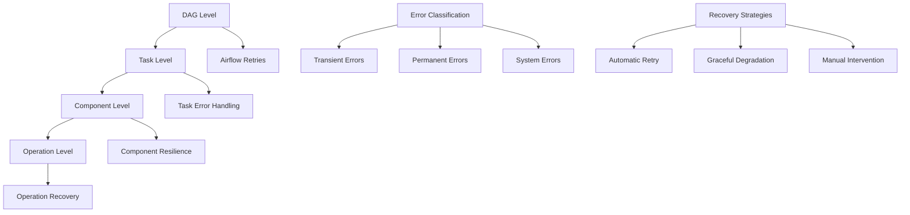

# Error Handling and Recovery Guide

## Table of Contents
1. [Error Handling Architecture](#error-handling-architecture)
2. [Error Categories and Classification](#error-categories-and-classification)
3. [Component-Level Error Handling](#component-level-error-handling)
4. [Recovery Procedures](#recovery-procedures)
5. [Monitoring and Alerting](#monitoring-and-alerting)
6. [Troubleshooting Playbook](#troubleshooting-playbook)
7. [Disaster Recovery](#disaster-recovery)
8. [Best Practices](#best-practices)

## Error Handling Architecture

The JobInsight crawler system implements a multi-layered error handling architecture designed for resilience and graceful degradation:



### Error Handling Principles
1. **Fail Fast**: Detect errors early and fail quickly for permanent issues
2. **Retry Smart**: Implement intelligent retry logic for transient issues
3. **Degrade Gracefully**: Continue operation with reduced functionality when possible
4. **Log Everything**: Comprehensive logging for debugging and monitoring
5. **Alert Appropriately**: Notify operators of critical issues requiring intervention

## Error Categories and Classification

### 1. Transient Errors (Retryable)
**Characteristics**: Temporary issues that may resolve automatically
**Strategy**: Retry with exponential backoff

```python
# Examples of transient errors
TRANSIENT_ERRORS = [
    "Connection timeout",
    "Temporary network failure",
    "Database connection refused",
    "Rate limiting (429 status)",
    "Server temporarily unavailable (503)",
    "Lock timeout",
    "Temporary file system issues"
]

# Retry configuration
RETRY_CONFIG = {
    'max_attempts': 3,
    'base_delay': 2,  # seconds
    'backoff_factor': 2,
    'max_delay': 60
}
```

### 2. Permanent Errors (Non-retryable)
**Characteristics**: Issues that won't resolve without intervention
**Strategy**: Fail fast and alert

```python
# Examples of permanent errors
PERMANENT_ERRORS = [
    "Authentication failure",
    "Invalid configuration",
    "Missing required files",
    "Schema validation errors",
    "Permission denied",
    "Disk space exhausted",
    "Memory exhaustion"
]
```

### 3. System Errors (Critical)
**Characteristics**: Infrastructure or system-level failures
**Strategy**: Immediate escalation and potential system shutdown

```python
# Examples of system errors
SYSTEM_ERRORS = [
    "Database server down",
    "File system corruption",
    "Network partition",
    "Container/service crash",
    "Resource exhaustion"
]
```

## Component-Level Error Handling

### 1. HTMLBackupManager Error Handling
**Location**: `src/crawler/backup_manager.py`

```python
async def backup_single_page(self, page_num: int) -> Dict[str, Any]:
    """Backup single page with comprehensive error handling"""
    result = {
        "page_num": page_num,
        "success": False,
        "error": None,
        "retry_count": 0
    }
    
    for attempt in range(self.max_retry + 1):
        try:
            # Browser operations with timeout
            async with async_playwright() as p:
                browser = await p.chromium.launch(headless=True)
                context = await browser.new_context(
                    user_agent=self.ua_manager.get_random_user_agent(),
                    viewport=self.ua_manager.get_random_viewport()
                )
                
                page = await context.new_page()
                
                # Apply anti-detection measures
                await self.captcha_handler.apply_anti_detection(page)
                
                # Navigate with timeout
                response = await page.goto(url, timeout=self.page_load_timeout)
                
                if response.status >= 400:
                    raise Exception(f"HTTP {response.status}: {response.status_text}")
                
                # Wait for content
                await page.wait_for_selector('.job-item-2', timeout=self.selector_timeout)
                
                # Get content and detect captcha
                html_content = await page.content()
                
                if self.captcha_handler.detect_captcha(html_content):
                    success, info = await self.captcha_handler.handle_captcha(page)
                    if not success:
                        raise Exception(f"Captcha handling failed: {info}")
                
                # Save HTML file
                filename = f"topcv_page_{page_num}_{timestamp}.html"
                file_path = self.backup_dir / filename
                
                with open(file_path, 'w', encoding='utf-8') as f:
                    f.write(html_content)
                
                result.update({
                    "success": True,
                    "filename": filename,
                    "file_size": len(html_content),
                    "job_count": html_content.count('data-job-id=')
                })
                
                logger.info(f"Successfully backed up page {page_num}")
                return result
                
        except asyncio.TimeoutError as e:
            error_msg = f"Timeout on page {page_num}, attempt {attempt + 1}: {str(e)}"
            logger.warning(error_msg)
            result["error"] = error_msg
            result["retry_count"] = attempt + 1
            
            if attempt < self.max_retry:
                delay = self.retry_delays[attempt]
                logger.info(f"Retrying page {page_num} in {delay} seconds...")
                await asyncio.sleep(delay)
            
        except Exception as e:
            error_msg = f"Error on page {page_num}, attempt {attempt + 1}: {str(e)}"
            logger.error(error_msg)
            result["error"] = error_msg
            result["retry_count"] = attempt + 1
            
            # Check if error is retryable
            if attempt < self.max_retry and self._is_retryable_error(str(e)):
                delay = self.retry_delays[attempt]
                logger.info(f"Retrying page {page_num} in {delay} seconds...")
                await asyncio.sleep(delay)
            else:
                logger.error(f"Permanent failure on page {page_num}: {str(e)}")
                break
        
        finally:
            # Cleanup browser resources
            try:
                if 'browser' in locals():
                    await browser.close()
            except:
                pass
    
    return result

def _is_retryable_error(self, error_message: str) -> bool:
    """Determine if error is retryable"""
    retryable_patterns = [
        "timeout", "connection", "network", "temporary",
        "503", "502", "504", "rate limit"
    ]
    return any(pattern in error_message.lower() for pattern in retryable_patterns)
```

### 2. TopCVParser Error Handling
**Location**: `src/crawler/parser.py`

```python
def parse_multiple_files(self, html_files=None) -> pd.DataFrame:
    """Parse with error isolation and recovery"""
    
    # Memory leak prevention (critical fix)
    with self._job_data_lock:
        self._job_id_processed.clear()
    
    if html_files is None:
        html_files = self.find_html_files()
    
    if not html_files:
        logger.warning("No HTML files found to parse")
        return pd.DataFrame()
    
    all_jobs = []
    failed_files = []
    
    if self.use_threading and len(html_files) > 1:
        # Concurrent processing with error isolation
        with ThreadPoolExecutor(max_workers=self.max_workers) as executor:
            future_to_file = {
                executor.submit(self._parse_single_file_safe, html_file): html_file 
                for html_file in html_files
            }
            
            for future in as_completed(future_to_file):
                html_file = future_to_file[future]
                try:
                    jobs = future.result(timeout=30)  # 30-second timeout per file
                    if jobs:
                        all_jobs.extend(jobs)
                        logger.info(f"Parsed {len(jobs)} jobs from {html_file.name}")
                    else:
                        logger.warning(f"No jobs parsed from {html_file.name}")
                        
                except concurrent.futures.TimeoutError:
                    logger.error(f"Timeout parsing {html_file.name}")
                    failed_files.append(str(html_file))
                    
                except Exception as e:
                    logger.error(f"Error parsing {html_file.name}: {str(e)}")
                    failed_files.append(str(html_file))
    else:
        # Sequential processing with error isolation
        for html_file in html_files:
            try:
                jobs = self._parse_single_file_safe(html_file)
                if jobs:
                    all_jobs.extend(jobs)
                    logger.info(f"Parsed {len(jobs)} jobs from {html_file.name}")
                else:
                    logger.warning(f"No jobs parsed from {html_file.name}")
                    
            except Exception as e:
                logger.error(f"Error parsing {html_file.name}: {str(e)}")
                failed_files.append(str(html_file))
    
    # Report parsing results
    if failed_files:
        logger.warning(f"Failed to parse {len(failed_files)} files: {failed_files}")
    
    if not all_jobs:
        logger.error("No jobs parsed from any HTML files")
        return pd.DataFrame()
    
    # Create DataFrame with error handling
    try:
        df = self._create_dataframe_safe(all_jobs)
        logger.info(f"Created DataFrame with {len(df)} unique jobs from {len(all_jobs)} total")
        return df
        
    except Exception as e:
        logger.error(f"Error creating DataFrame: {str(e)}")
        return pd.DataFrame()

def _parse_single_file_safe(self, html_file: Path) -> List[Dict[str, Any]]:
    """Parse single file with error handling"""
    try:
        with open(html_file, 'r', encoding='utf-8') as f:
            html_content = f.read()
        
        soup = BeautifulSoup(html_content, 'html.parser')
        job_items = soup.select('.job-item-2')
        
        if not job_items:
            logger.warning(f"No job items found in {html_file.name}")
            return []
        
        jobs = []
        for job_item in job_items:
            try:
                job_data = self.extract_job_data(job_item)
                if job_data and job_data.get('job_id'):
                    jobs.append(job_data)
                    
            except Exception as e:
                logger.warning(f"Error extracting job data: {str(e)}")
                continue  # Skip this job, continue with others
        
        return jobs
        
    except Exception as e:
        logger.error(f"Error reading/parsing {html_file}: {str(e)}")
        raise
```

### 3. Database Operations Error Handling
**Location**: `src/db/bulk_operations.py`

```python
def bulk_insert_with_copy(self, df, table_name, schema='public'):
    """Bulk insert with comprehensive error handling"""
    result = {'rows_inserted': 0, 'execution_time': 0, 'errors': []}
    
    try:
        # Use connection pool (critical fix)
        with get_pooled_connection() as conn:
            with conn.cursor() as cur:
                # Prepare data
                output = StringIO()
                df.to_csv(output, sep='\t', header=False, index=False, na_rep='\\N')
                output.seek(0)
                
                # Execute COPY with error handling
                copy_query = f"COPY {schema}.{table_name} FROM STDIN WITH CSV DELIMITER E'\\t' NULL '\\N'"
                
                start_time = datetime.now()
                cur.copy_expert(copy_query, output)
                end_time = datetime.now()
                
                result.update({
                    'rows_inserted': len(df),
                    'execution_time': (end_time - start_time).total_seconds()
                })
                
                logger.info(f"Successfully inserted {result['rows_inserted']} rows")
                
    except psycopg2.IntegrityError as e:
        error_msg = f"Data integrity error: {str(e)}"
        logger.error(error_msg)
        result['errors'].append(error_msg)
        raise
        
    except psycopg2.OperationalError as e:
        error_msg = f"Database operational error: {str(e)}"
        logger.error(error_msg)
        result['errors'].append(error_msg)
        
        # Check if retryable
        if "connection" in str(e).lower() or "timeout" in str(e).lower():
            logger.info("Retryable database error detected")
            raise  # Let retry logic handle it
        else:
            logger.error("Non-retryable database error")
            raise
            
    except Exception as e:
        error_msg = f"Unexpected database error: {str(e)}"
        logger.error(error_msg)
        result['errors'].append(error_msg)
        raise
    
    return result
```

### 4. CDC System Error Handling
**Location**: `src/ingestion/cdc.py`

```python
@retry(max_tries=3, delay_seconds=1.0, backoff_factor=2.0)
def save_cdc_record(job_id: str, action: str, data: Dict[str, Any]) -> bool:
    """Save CDC record with retry logic"""
    try:
        cdc_record = {
            "timestamp": datetime.now().isoformat(),
            "job_id": job_id,
            "action": action,
            "data": data,
            "metadata": {
                "source": "crawler",
                "batch_id": str(uuid.uuid4())
            }
        }
        
        cdc_file = get_cdc_filepath(datetime.now())
        
        # File locking for concurrency safety
        lock_file = f"{cdc_file}.lock"
        with filelock.FileLock(lock_file, timeout=10):
            with open(cdc_file, 'a', encoding='utf-8') as f:
                json.dump(cdc_record, f, ensure_ascii=False, default=str)
                f.write('\n')
        
        return True
        
    except filelock.Timeout:
        logger.error(f"CDC file lock timeout for job_id: {job_id}")
        return False
        
    except IOError as e:
        logger.error(f"CDC file I/O error for job_id {job_id}: {str(e)}")
        return False
        
    except Exception as e:
        logger.error(f"Unexpected CDC error for job_id {job_id}: {str(e)}")
        return False
```

## Recovery Procedures

### 1. Automatic Recovery Mechanisms

#### Airflow DAG Level Recovery
```python
# DAG configuration for automatic recovery
default_args = {
    'retries': 2,
    'retry_delay': timedelta(minutes=2),
    'retry_exponential_backoff': False,
    'max_retry_delay': timedelta(minutes=10)
}
```

#### Component Level Recovery
```python
# Crawler recovery logic
async def crawl_with_recovery(self, num_pages=None):
    """Main crawl method with recovery capabilities"""
    max_attempts = 3
    
    for attempt in range(max_attempts):
        try:
            result = await self.crawl(num_pages)
            
            # Validate result
            if result['success'] and result.get('database', {}).get('total_processed', 0) > 0:
                return result
            else:
                raise Exception("Crawl completed but no data processed")
                
        except Exception as e:
            logger.error(f"Crawl attempt {attempt + 1} failed: {str(e)}")
            
            if attempt < max_attempts - 1:
                delay = 2 ** attempt  # Exponential backoff
                logger.info(f"Retrying crawl in {delay} seconds...")
                await asyncio.sleep(delay)
            else:
                logger.error("All crawl attempts failed")
                return {
                    "success": False,
                    "error": f"Failed after {max_attempts} attempts: {str(e)}"
                }
```

### 2. Manual Recovery Procedures

#### Partial Crawl Recovery
```bash
# If only some pages failed to backup
# 1. Check which pages succeeded
grep "Successfully backed up page" /opt/airflow/logs/crawl_topcv_jobs/

# 2. Manually trigger parsing of available files
python -c "
from src.crawler.parser import TopCVParser
parser = TopCVParser()
df = parser.parse_multiple_files()
print(f'Parsed {len(df)} jobs from available files')
"

# 3. Manually ingest parsed data
python -c "
from src.ingestion.ingest import ingest_dataframe
result = ingest_dataframe(df)
print(f'Ingested: {result}')
"
```

#### Database Recovery
```bash
# If database operations failed
# 1. Check database connectivity
python -c "
from src.db.connection_pool import get_connection_pool
pool = get_connection_pool()
print(f'Health check: {pool.health_check()}')
print(f'Pool stats: {pool.get_connection_stats()}')
"

# 2. Replay from CDC logs if needed
python -c "
from src.ingestion.cdc import replay_cdc_records
result = replay_cdc_records('data/cdc/20250108/cdc_20250108_110000.json')
print(f'Replay result: {result}')
"
```

#### File System Recovery
```bash
# If file system issues occur
# 1. Check disk space
df -h

# 2. Clean up old files manually
python -c "
from src.utils.cleanup import cleanup_all_temp_files
result = cleanup_all_temp_files(html_days_to_keep=7, cdc_days_to_keep=7)
print(f'Cleanup result: {result}')
"

# 3. Verify file permissions
ls -la data/raw_backup/ data/cdc/
```

## Monitoring and Alerting

### Key Metrics to Monitor
```python
# Success rate metrics
success_rate_threshold = 0.95  # 95% success rate
job_count_threshold = 50       # Minimum jobs per crawl
execution_time_threshold = 120  # Maximum 2 minutes

# Error rate metrics
error_rate_threshold = 0.05    # 5% error rate
consecutive_failures = 3       # Alert after 3 consecutive failures

# Resource metrics
memory_usage_threshold = 500   # MB
disk_usage_threshold = 0.8     # 80% disk usage
connection_pool_threshold = 0.8 # 80% pool utilization
```

### Alerting Rules
```python
# Critical alerts (immediate notification)
CRITICAL_ALERTS = [
    "All crawl attempts failed",
    "Database connection pool exhausted",
    "Disk space below 10%",
    "Memory usage above 1GB",
    "CDC file system errors"
]

# Warning alerts (notification within 15 minutes)
WARNING_ALERTS = [
    "Success rate below 95%",
    "Job count below threshold",
    "Execution time above threshold",
    "Connection pool utilization above 80%"
]
```

## Troubleshooting Playbook

### Common Issues and Solutions

#### Issue 1: No Jobs Parsed
**Symptoms**: DataFrame empty after parsing
**Diagnosis**:
```bash
# Check HTML files exist
ls -la data/raw_backup/

# Check HTML content
head -n 50 data/raw_backup/topcv_page_1_*.html

# Check for captcha/blocking
grep -i "captcha\|robot\|access denied" data/raw_backup/*.html
```

**Solutions**:
1. Verify TopCV website structure hasn't changed
2. Check anti-detection measures are working
3. Update CSS selectors if needed
4. Increase delays between requests

#### Issue 2: Database Connection Failures
**Symptoms**: Connection timeout or refused errors
**Diagnosis**:
```bash
# Check database status
docker-compose ps postgres

# Test connection
python -c "
from src.db.connection_pool import get_connection_pool
pool = get_connection_pool()
print(pool.health_check())
"
```

**Solutions**:
1. Restart database container
2. Check connection pool configuration
3. Verify database credentials
4. Check network connectivity

#### Issue 3: Memory Issues
**Symptoms**: Out of memory errors or high memory usage
**Diagnosis**:
```bash
# Check memory usage
docker stats

# Check parser memory management
python -c "
from src.crawler.parser import TopCVParser
parser = TopCVParser()
stats = parser.clear_memory_cache()
print(f'Memory stats: {stats}')
"
```

**Solutions**:
1. Verify memory leak fix is active
2. Reduce concurrent processing
3. Increase container memory limits
4. Monitor memory usage trends

## Disaster Recovery

### Backup Strategy
```bash
# Daily backups
# 1. Database backup
pg_dump jobinsight > backup_$(date +%Y%m%d).sql

# 2. CDC logs backup
tar -czf cdc_backup_$(date +%Y%m%d).tar.gz data/cdc/

# 3. Configuration backup
tar -czf config_backup_$(date +%Y%m%d).tar.gz dags/ src/ docker-compose.yml
```

### Recovery Strategy
```bash
# Full system recovery
# 1. Restore database
psql jobinsight < backup_20250108.sql

# 2. Restore CDC logs
tar -xzf cdc_backup_20250108.tar.gz

# 3. Restart services
docker-compose down
docker-compose up -d

# 4. Verify system health
python -c "
from src.crawler.crawler import TopCVCrawler
result = TopCVCrawler.run({'num_pages': 1})
print(f'Health check: {result[\"success\"]}')
"
```

## Best Practices

### Error Handling Best Practices
1. **Log Structured Data**: Use JSON logging for better parsing
2. **Include Context**: Log relevant context with errors
3. **Classify Errors**: Distinguish between transient and permanent errors
4. **Implement Circuit Breakers**: Prevent cascade failures
5. **Monitor Error Patterns**: Track error trends and patterns

### Recovery Best Practices
1. **Test Recovery Procedures**: Regular disaster recovery drills
2. **Document Procedures**: Keep recovery procedures up to date
3. **Automate Where Possible**: Reduce manual intervention
4. **Monitor Recovery Success**: Verify recovery effectiveness
5. **Learn from Failures**: Post-incident analysis and improvements

---

*This guide provides comprehensive error handling and recovery procedures for the JobInsight crawler system. Regular review and testing of these procedures is essential for maintaining system reliability.*
