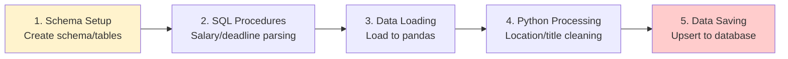

# JobInsight ETL - Raw to Staging Architecture

## Performance Overview

**⚠️ Performance Baseline**: Chưa có comprehensive production metrics

### 📊 **Available Metrics**
- **Execution Time**: Tracked per phase với performance_monitor context manager
- **Memory Usage**: Monitored nếu psutil available (typical usage varies)
- **Success Rate**: Calculated based on processed vs total records
- **Batch Processing**: Default batch_size=None (process all), configurable
- **Schedule**: Daily at 11:02 AM Vietnam time after crawler completion

## 5-Phase Processing Pipeline



### **Performance Monitoring**: Each phase tracked với performance_monitor context manager

## Phase Details

| Phase | Purpose | Implementation | Monitoring |
|-------|---------|----------------|------------|
| **1. Schema Setup** | Create schema/tables | Execute SQL files | ✅ Performance tracked |
| **2. SQL Procedures** | Salary/deadline parsing | Stored procedures | ✅ Performance tracked |
| **3. Data Loading** | Load to pandas | get_dataframe() | ✅ Performance tracked |
| **4. Python Processing** | Location/title cleaning | Data transformation functions | ✅ Performance tracked |
| **5. Data Saving** | Upsert to database | save_back_to_staging() | ✅ Performance tracked |

## Data Transformation

### **SQL Transformations** (Bulk Operations)
- Copy raw_jobs → staging_jobs
- Parse salary: "10-15 triệu VND" → min/max/type
- Convert deadline: "31/12/2024" → timestamp

### **Python Transformations** (Complex Logic)
- Extract location details from HTML
- Handle multiple locations (split by "&")
- Clean job titles và company names

## 🛠️ **Built-in Features**

### **Performance Monitoring**
- Per-phase execution time tracking
- Memory usage monitoring (if psutil available)
- CPU usage tracking
- Comprehensive logging

### **Error Handling**
- ETL integrity validation với verify_etl_integrity()
- Exception handling per phase
- Detailed error logging
- Graceful failure recovery

## 🎯 **Potential Optimization Opportunities**

### **1. Batch Database Operations** (Theoretical)
- **Current**: Individual operations trong save_back_to_staging()
- **Opportunity**: Implement batch upserts
- **Status**: Not yet implemented

### **2. Schema Validation Caching** (Theoretical)
- **Current**: Schema checks mỗi lần run
- **Opportunity**: Cache schema existence checks
- **Status**: Not yet implemented

### **3. Parallel Processing** (Theoretical)
- **Current**: Sequential data processing
- **Opportunity**: ThreadPoolExecutor for transformations
- **Status**: Not yet implemented

## 📊 **Monitoring và Dependencies**

### **Performance Monitoring Implementation**
```python
@contextmanager
def performance_monitor(phase_name):
    # Tracks: Duration, Memory usage, CPU usage
    # Logs: Detailed performance metrics per phase
```

### **Key Dependencies**
- **Upstream**: Crawler completion (ExternalTaskSensor)
- **Database**: PostgreSQL availability
- **SQL Files**: schema_staging.sql, insert_raw_to_staging.sql, stored_procedures.sql
- **Downstream**: Phase 3 ETL (staging_to_dwh)

---

*For implementation details: [Implementation & Performance](02_implementation_performance.md)*
*For troubleshooting: [Troubleshooting Guide](04_troubleshooting_guide.md)*
