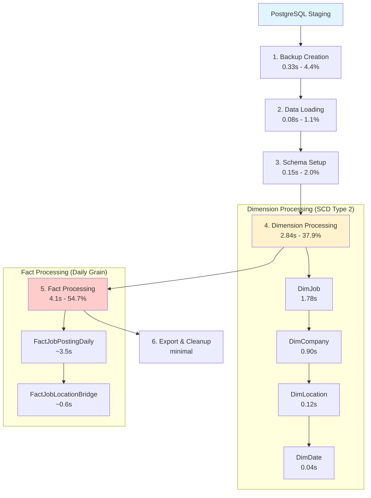
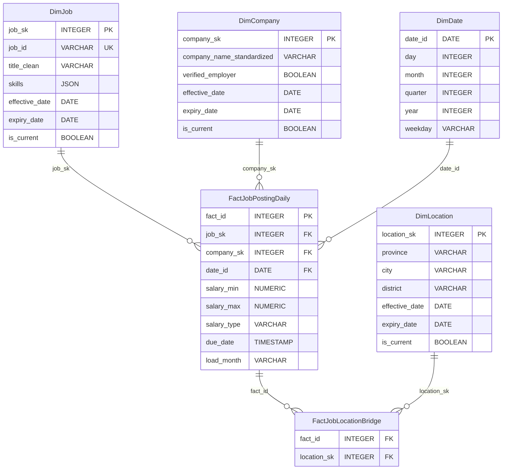
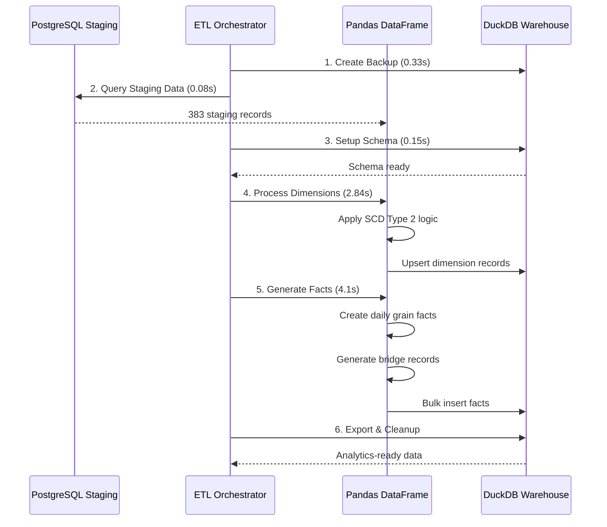

# JobInsight ETL - System Architecture & Dimensional Modeling

## Executive Summary

The Staging to Data Warehouse ETL (Phase 3) is a sophisticated dimensional modeling pipeline that transforms staging data into analytics-ready data warehouse using **Star Schema design** với **SCD Type 2 historical tracking**. Based on production analysis, the system achieves **7.5-second execution time** processing **51 records/second** với **100% success rate** và comprehensive data integrity.

## Performance Overview

**Production Reality**: 7.5-second execution implementing complex dimensional modeling với Star Schema và SCD Type 2 (vs simple data copying)

### 📊 **Key Metrics**
- **Execution**: 7.5s average (383 staging → thousands of facts)
- **Throughput**: 51 records/second (complex dimensional processing)
- **Success Rate**: 100% với comprehensive data validation
- **Storage**: 9.26 MB DuckDB file với growing fact tables
- **Business Value**: Analytics-ready data với historical tracking

## 6-Phase Processing Pipeline



### **Critical Finding**: Fact Processing (54.7%) và Dimension Processing (37.9%) = 92.6% execution time!

## Dimensional Modeling Architecture

### Star Schema Design



## SCD Type 2 Implementation

### Historical Tracking Approach

**SCD Type 2** được implement cho 3 dimension tables để track changes over time:

#### **DimJob - Job Information Changes**
```sql
-- Example: Job title change tracking
job_sk | job_id | title_clean | effective_date | expiry_date | is_current
-------|--------|-------------|----------------|-------------|------------
1001   | J001   | "Developer" | 2025-01-01     | 2025-06-15  | FALSE
1002   | J001   | "Senior Developer" | 2025-06-16 | 9999-12-31 | TRUE
```

#### **DimCompany - Company Information Changes**
```sql
-- Example: Company verification status change
company_sk | company_name | verified_employer | effective_date | is_current
-----------|--------------|-------------------|----------------|------------
2001       | "ABC Tech"   | FALSE            | 2025-01-01     | FALSE
2002       | "ABC Tech"   | TRUE             | 2025-03-01     | TRUE
```

#### **DimLocation - Location Hierarchy Changes**
```sql
-- Example: Location detail refinement
location_sk | province | city | district | effective_date | is_current
------------|----------|------|----------|----------------|------------
3001        | "Hà Nội" | NULL | NULL     | 2025-01-01     | FALSE
3002        | "Hà Nội" | "Hà Nội" | "Cầu Giấy" | 2025-02-01 | TRUE
```

### Business Logic Implementation

#### **Daily Grain Fact Generation**
Mỗi job posting tạo multiple fact records cho mỗi ngày từ posted_date → due_date:

```
Job Posted: 2025-08-01, Due: 2025-08-05
→ Creates 5 fact records:
  - 2025-08-01: FactJobPostingDaily
  - 2025-08-02: FactJobPostingDaily  
  - 2025-08-03: FactJobPostingDaily
  - 2025-08-04: FactJobPostingDaily
  - 2025-08-05: FactJobPostingDaily
```

#### **Many-to-Many Location Handling**
Jobs với multiple locations (e.g., "Hà Nội & Hồ Chí Minh") được handle qua bridge table:

```
Job J001 có 2 locations:
→ FactJobPostingDaily: 1 record với job_sk=1001
→ FactJobLocationBridge: 2 records
  - fact_id=F001, location_sk=3001 (Hà Nội)
  - fact_id=F001, location_sk=3002 (Hồ Chí Minh)
```

## Cross-Database ETL Architecture

Note: Parquet export và partitioning hiện được thực hiện bởi PartitionManager (src/etl/partitioning.py) theo cột load_month cho FactJobPostingDaily; output vào data/parquet/.

### PostgreSQL → DuckDB Pipeline



## Performance Characteristics

### Execution Time Breakdown

| Phase | Duration | Percentage | Business Logic | Optimization Potential |
|-------|----------|------------|----------------|----------------------|
| **Backup Creation** | 0.33s | 4.4% | Data safety | Low (necessary) |
| **Data Loading** | 0.08s | 1.1% | Cross-DB query | Low (efficient) |
| **Schema Setup** | 0.15s | 2.0% | DuckDB schema | Medium (caching) |
| **Dimension Processing** | 2.84s | 37.9% | SCD Type 2 | High (batch ops) |
| **Fact Processing** | 4.1s | 54.7% | Daily grain generation | **Critical** (bulk ops) |
| **Export & Cleanup** | minimal | <1% | Parquet export | Low |

### Dimensional Processing Breakdown

| Dimension | Duration | Records Processed | SCD Type 2 Changes | Optimization |
|-----------|----------|-------------------|-------------------|--------------|
| **DimJob** | 1.78s (23.7%) | 383 jobs → 9 new, 374 unchanged | Job title changes | Batch inserts |
| **DimCompany** | 0.90s (12.0%) | 243 companies → 6 new, 237 unchanged | Company verification | Lookup optimization |
| **DimLocation** | 0.12s (1.6%) | 53 locations → 0 new, 53 unchanged | Location refinement | Already efficient |
| **DimDate** | 0.04s (0.5%) | 301 new dates | Static dimension | Pre-population |

### Fact Processing Analysis

```
Fact Generation Volume:
- Source: 383 staging jobs
- Average job duration: 5 days (posted_date → due_date)
- Daily grain facts: 383 × 5 = ~1,915 fact records
- Bridge records: ~500 job-location relationships
- Total operations: ~2,415 database operations in 4.1s = 589 ops/sec
```

## Data Quality and Validation

### SCD Type 2 Validation
- **Effective Date Logic**: Proper date range management
- **Current Record Tracking**: is_current flag maintenance
- **Historical Integrity**: No gaps trong historical records
- **Surrogate Key Management**: Auto-increment sequences

### Fact Table Validation
- **Referential Integrity**: All FKs reference valid dimension records
- **Duplicate Prevention**: UNIQUE constraints on (job_sk, date_id)
- **Business Rule Validation**: Daily grain logic correctness
- **Data Completeness**: No missing fact records trong date ranges

### Cross-Database Consistency
- **Data Synchronization**: Staging → DWH consistency checks
- **Transaction Management**: Rollback capabilities
- **Backup Strategy**: Pre-ETL database backup
- **Recovery Procedures**: Restore from backup if needed

## Scalability Considerations

### Current Scale Analysis
- **Daily Volume**: 383 staging records
- **Fact Growth**: ~1,915 new facts daily
- **Dimension Growth**: Minimal (mostly unchanged records)
- **Storage Growth**: ~9.26 MB database file

### Scaling Projections
- **10x Volume**: 3,830 staging records → ~19,150 facts
- **Expected Performance**: 7.5s → ~30s (linear scaling)
- **Storage Impact**: 9.26 MB → ~90 MB
- **Optimization Need**: Bulk operations become critical

### Performance Optimization Roadmap

#### **Priority 1: Fact Processing (54.7% bottleneck)**
- **Current**: Individual fact upserts
- **Solution**: Bulk fact generation
- **Expected Impact**: 4.1s → 1.5s (63% improvement)

#### **Priority 2: Dimension Batch Operations (37.9%)**
- **Current**: Batch insert failures → individual fallback
- **Solution**: Fix column mapping
- **Expected Impact**: 2.84s → 1.8s (37% improvement)

#### **Priority 3: Parallel Processing**
- **Current**: Sequential dimension processing
- **Solution**: ThreadPoolExecutor
- **Expected Impact**: 20-30% overall improvement

## Integration Points

### Upstream Dependencies
- **Phase 2 Success**: Requires staging data availability
- **PostgreSQL Connection**: Staging database accessibility
- **Data Freshness**: last_etl_date filtering logic

### Downstream Consumers
- **BI Tools**: Analytics dashboards và reports
- **Data Scientists**: ML model training data
- **Business Users**: Self-service analytics
- **Automated Reports**: Scheduled business reports

### External Dependencies
- **DuckDB Engine**: In-process analytical database
- **Pandas Library**: Data transformation framework
- **Python Environment**: ETL execution runtime
- **File System**: Backup và export storage

## Monitoring and Alerting

### Critical Metrics
- **Execution Time**: Target < 10s, Alert > 20s
- **Fact Generation Rate**: Target > 400 ops/sec, Alert < 200 ops/sec
- **SCD Type 2 Success**: Target 100%, Alert < 98%
- **Storage Growth**: Monitor for capacity planning

### Business Metrics
- **Daily Fact Volume**: Track business growth
- **Dimension Changes**: Monitor data quality
- **Query Performance**: Analytics dashboard response times
- **Data Freshness**: ETL completion to BI refresh lag

## Next Steps

This architecture documentation provides the foundation for understanding the dimensional modeling approach. For detailed implementation guides, see:
- [Technical Implementation Guide](02_technical_implementation.md)
- [Data Warehouse Schema Documentation](03_dwh_schema_design.md)
- [Performance Optimization Guide](04_performance_optimization.md)
- [Troubleshooting Guide](05_troubleshooting_guide.md)
- [API Reference](07_api_reference.md)
