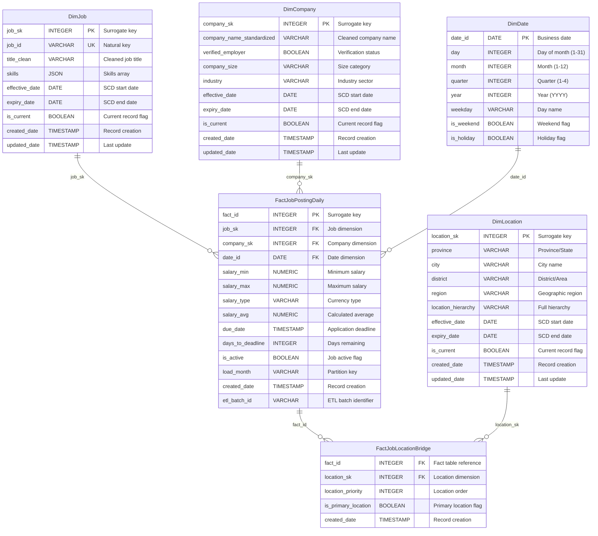

# JobInsight Data Warehouse - Schema Design Documentation

## Overview

Complete data warehouse schema reference cho JobInsight analytics platform, implementing **Star Schema design** với **SCD Type 2 historical tracking**. Schema được optimize cho business intelligence queries và supports comprehensive job market analytics.

## Star Schema Architecture

### Schema Overview



## Dimension Tables

### DimJob - Job Information Dimension

#### Table Structure
```sql
CREATE TABLE DimJob (
    job_sk INTEGER PRIMARY KEY,
    job_id VARCHAR(20) UNIQUE NOT NULL,
    title_clean VARCHAR(255),
    skills JSON,
    effective_date DATE NOT NULL,
    expiry_date DATE NOT NULL,
    is_current BOOLEAN NOT NULL DEFAULT TRUE,
    created_date TIMESTAMP DEFAULT CURRENT_TIMESTAMP,
    updated_date TIMESTAMP DEFAULT CURRENT_TIMESTAMP
);

-- Indexes for performance
CREATE INDEX idx_dimjob_job_id ON DimJob(job_id);
CREATE INDEX idx_dimjob_current ON DimJob(is_current);
CREATE INDEX idx_dimjob_effective ON DimJob(effective_date, expiry_date);
```

#### SCD Type 2 Example
```sql
-- Job title evolution tracking
job_sk | job_id | title_clean | effective_date | expiry_date | is_current
-------|--------|-------------|----------------|-------------|------------
1001   | J001   | "Developer" | 2025-01-01     | 2025-06-15  | FALSE
1002   | J001   | "Senior Developer" | 2025-06-16 | 9999-12-31 | TRUE
1003   | J001   | "Lead Developer" | 2025-08-01 | 9999-12-31 | TRUE
```

#### Business Rules
- **Natural Key**: job_id (from source system)
- **SCD Type 2**: Track changes trong job titles, skills
- **Effective Dating**: effective_date ≤ business_date < expiry_date
- **Current Record**: is_current = TRUE cho latest version
- **Skills Format**: JSON array ["Python", "SQL", "Machine Learning"]

### DimCompany - Company Information Dimension

#### Table Structure
```sql
CREATE TABLE DimCompany (
    company_sk INTEGER PRIMARY KEY,
    company_name_standardized VARCHAR(200) NOT NULL,
    verified_employer BOOLEAN DEFAULT FALSE,
    company_size VARCHAR(50),
    industry VARCHAR(100),
    effective_date DATE NOT NULL,
    expiry_date DATE NOT NULL,
    is_current BOOLEAN NOT NULL DEFAULT TRUE,
    created_date TIMESTAMP DEFAULT CURRENT_TIMESTAMP,
    updated_date TIMESTAMP DEFAULT CURRENT_TIMESTAMP
);

-- Indexes
CREATE INDEX idx_dimcompany_name ON DimCompany(company_name_standardized);
CREATE INDEX idx_dimcompany_current ON DimCompany(is_current);
CREATE INDEX idx_dimcompany_verified ON DimCompany(verified_employer);
```

#### SCD Type 2 Example
```sql
-- Company verification status tracking
company_sk | company_name | verified_employer | effective_date | is_current
-----------|--------------|-------------------|----------------|------------
2001       | "ABC Tech"   | FALSE            | 2025-01-01     | FALSE
2002       | "ABC Tech"   | TRUE             | 2025-03-01     | TRUE
```

#### Business Rules
- **Natural Key**: company_name_standardized
- **SCD Type 2**: Track verification status changes
- **Standardization**: Cleaned company names (trim, case normalization)
- **Verification**: verified_employer flag từ external validation

### DimLocation - Location Hierarchy Dimension

#### Table Structure
```sql
CREATE TABLE DimLocation (
    location_sk INTEGER PRIMARY KEY,
    province VARCHAR(100),
    city VARCHAR(100),
    district VARCHAR(100),
    region VARCHAR(50),
    location_hierarchy VARCHAR(300),
    effective_date DATE NOT NULL,
    expiry_date DATE NOT NULL,
    is_current BOOLEAN NOT NULL DEFAULT TRUE,
    created_date TIMESTAMP DEFAULT CURRENT_TIMESTAMP,
    updated_date TIMESTAMP DEFAULT CURRENT_TIMESTAMP
);

-- Indexes
CREATE INDEX idx_dimlocation_province ON DimLocation(province);
CREATE INDEX idx_dimlocation_hierarchy ON DimLocation(location_hierarchy);
CREATE INDEX idx_dimlocation_current ON DimLocation(is_current);
```

#### Location Hierarchy Example
```sql
-- Location detail refinement tracking
location_sk | province | city | district | location_hierarchy | is_current
------------|----------|------|----------|-------------------|------------
3001        | "Hà Nội" | NULL | NULL     | "Hà Nội"          | FALSE
3002        | "Hà Nội" | "Hà Nội" | "Cầu Giấy" | "Hà Nội > Hà Nội > Cầu Giấy" | TRUE
```

#### Business Rules
- **Hierarchy**: Province > City > District structure
- **SCD Type 2**: Track location detail refinements
- **Multiple Locations**: Handled via bridge table
- **Standardization**: Consistent location naming

### DimDate - Time Dimension

#### Table Structure
```sql
CREATE TABLE DimDate (
    date_id DATE PRIMARY KEY,
    day INTEGER NOT NULL,
    month INTEGER NOT NULL,
    quarter INTEGER NOT NULL,
    year INTEGER NOT NULL,
    weekday VARCHAR(10) NOT NULL,
    is_weekend BOOLEAN NOT NULL,
    is_holiday BOOLEAN DEFAULT FALSE,
    month_name VARCHAR(20),
    quarter_name VARCHAR(10)
);

-- Indexes
CREATE INDEX idx_dimdate_year_month ON DimDate(year, month);
CREATE INDEX idx_dimdate_quarter ON DimDate(quarter, year);
```

#### Business Rules
- **Static Dimension**: Pre-populated với date ranges
- **Date Range**: 2020-01-01 to 2030-12-31
- **Business Calendar**: Vietnamese holidays marked
- **Time Intelligence**: Supports year-over-year, quarter-over-quarter analysis

## Fact Tables

### FactJobPostingDaily - Daily Grain Facts

#### Table Structure
```sql
CREATE TABLE FactJobPostingDaily (
    fact_id INTEGER PRIMARY KEY,
    job_sk INTEGER NOT NULL,
    company_sk INTEGER NOT NULL,
    date_id DATE NOT NULL,
    salary_min NUMERIC(12,2),
    salary_max NUMERIC(12,2),
    salary_type VARCHAR(20),
    salary_avg NUMERIC(12,2),
    due_date TIMESTAMP,
    days_to_deadline INTEGER,
    is_active BOOLEAN NOT NULL DEFAULT TRUE,
    load_month VARCHAR(7) NOT NULL,
    created_date TIMESTAMP DEFAULT CURRENT_TIMESTAMP,
    etl_batch_id VARCHAR(50),
    
    -- Constraints
    UNIQUE (job_sk, date_id),
    FOREIGN KEY (job_sk) REFERENCES DimJob(job_sk),
    FOREIGN KEY (company_sk) REFERENCES DimCompany(company_sk),
    FOREIGN KEY (date_id) REFERENCES DimDate(date_id)
);

-- Partitioning by load_month
CREATE INDEX idx_factjob_load_month ON FactJobPostingDaily(load_month);
CREATE INDEX idx_factjob_date ON FactJobPostingDaily(date_id);
CREATE INDEX idx_factjob_company ON FactJobPostingDaily(company_sk);
```

*For complete schema details, see full documentation file.*

This schema documentation provides the foundation for analytics và business intelligence development. For implementation details, see [Technical Implementation Guide](02_technical_implementation.md).
