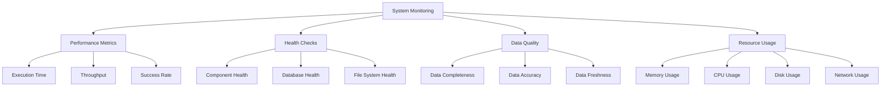

# Monitoring and Maintenance Guide

## Table of Contents
1. [Monitoring Overview](#monitoring-overview)
2. [Key Performance Indicators](#key-performance-indicators)
3. [System Health Monitoring](#system-health-monitoring)
4. [Performance Monitoring](#performance-monitoring)
5. [Data Quality Monitoring](#data-quality-monitoring)
6. [Alerting and Notifications](#alerting-and-notifications)
7. [Routine Maintenance Tasks](#routine-maintenance-tasks)
8. [Troubleshooting and Diagnostics](#troubleshooting-and-diagnostics)

## Monitoring Overview

The JobInsight crawler system requires comprehensive monitoring to ensure reliable operation, optimal performance, and data quality. This guide covers monitoring strategies, key metrics, maintenance procedures, and troubleshooting approaches.



## Key Performance Indicators

### 1. Operational KPIs

#### Crawler Success Rate
```sql
-- Daily crawler success rate
SELECT 
    DATE(execution_date) as crawl_date,
    COUNT(*) as total_runs,
    SUM(CASE WHEN state = 'success' THEN 1 ELSE 0 END) as successful_runs,
    ROUND(
        SUM(CASE WHEN state = 'success' THEN 1 ELSE 0 END) * 100.0 / COUNT(*), 
        2
    ) as success_rate_percent
FROM dag_run 
WHERE dag_id = 'crawl_topcv_jobs'
    AND execution_date >= CURRENT_DATE - INTERVAL '30 days'
GROUP BY DATE(execution_date)
ORDER BY crawl_date DESC;
```

**Target**: >95% success rate
**Alert Threshold**: <90% success rate for 3 consecutive days

#### Job Collection Rate
```sql
-- Daily job collection metrics
SELECT 
    DATE(crawled_at) as crawl_date,
    COUNT(*) as jobs_collected,
    COUNT(DISTINCT company_name) as unique_companies,
    COUNT(DISTINCT location) as unique_locations,
    AVG(CASE WHEN skills IS NOT NULL THEN json_array_length(skills) END) as avg_skills_per_job
FROM raw_jobs 
WHERE crawled_at >= CURRENT_DATE - INTERVAL '30 days'
GROUP BY DATE(crawled_at)
ORDER BY crawl_date DESC;
```

**Target**: 100-125 jobs per crawl session
**Alert Threshold**: <50 jobs per session

#### Execution Time Performance
```sql
-- Execution time trends
SELECT 
    DATE(start_date) as execution_date,
    task_id,
    AVG(EXTRACT(EPOCH FROM (end_date - start_date))) as avg_duration_seconds,
    MAX(EXTRACT(EPOCH FROM (end_date - start_date))) as max_duration_seconds,
    MIN(EXTRACT(EPOCH FROM (end_date - start_date))) as min_duration_seconds
FROM task_instance 
WHERE dag_id = 'crawl_topcv_jobs'
    AND state = 'success'
    AND start_date >= CURRENT_DATE - INTERVAL '30 days'
GROUP BY DATE(start_date), task_id
ORDER BY execution_date DESC, task_id;
```

**Target**: 
- `crawl_and_process`: 45-60 seconds
- `cleanup_temp_files`: 2-5 seconds

**Alert Threshold**: >120 seconds for crawl_and_process

### 2. Data Quality KPIs

#### Data Completeness
```sql
-- Data completeness metrics
SELECT 
    DATE(crawled_at) as crawl_date,
    COUNT(*) as total_jobs,
    COUNT(CASE WHEN title IS NOT NULL AND title != '' THEN 1 END) as jobs_with_title,
    COUNT(CASE WHEN company_name IS NOT NULL AND company_name != '' THEN 1 END) as jobs_with_company,
    COUNT(CASE WHEN salary IS NOT NULL AND salary != '' THEN 1 END) as jobs_with_salary,
    COUNT(CASE WHEN skills IS NOT NULL AND json_array_length(skills) > 0 THEN 1 END) as jobs_with_skills,
    ROUND(COUNT(CASE WHEN title IS NOT NULL THEN 1 END) * 100.0 / COUNT(*), 2) as title_completeness,
    ROUND(COUNT(CASE WHEN company_name IS NOT NULL THEN 1 END) * 100.0 / COUNT(*), 2) as company_completeness
FROM raw_jobs 
WHERE crawled_at >= CURRENT_DATE - INTERVAL '7 days'
GROUP BY DATE(crawled_at)
ORDER BY crawl_date DESC;
```

**Target**: >95% completeness for critical fields (title, company_name)
**Alert Threshold**: <90% completeness for critical fields

#### Data Freshness
```sql
-- Data freshness monitoring
SELECT 
    MAX(crawled_at) as last_crawl,
    EXTRACT(EPOCH FROM (NOW() - MAX(crawled_at))) / 3600 as hours_since_last_crawl,
    COUNT(*) as jobs_today
FROM raw_jobs 
WHERE DATE(crawled_at) = CURRENT_DATE;
```

**Target**: Data updated within 24 hours
**Alert Threshold**: >36 hours since last successful crawl

## System Health Monitoring

### 1. Component Health Checks

#### Crawler Health Check
```python
# Health check script: scripts/health_check.py
import asyncio
from src.crawler.crawler import TopCVCrawler
from src.db.connection_pool import get_connection_pool
from src.utils.logger import get_logger

logger = get_logger("health_check")

async def crawler_health_check():
    """Comprehensive crawler health check"""
    health_status = {
        "crawler": False,
        "database": False,
        "file_system": False,
        "memory": False,
        "overall": False
    }
    
    try:
        # Test crawler components
        crawler = TopCVCrawler()
        
        # Test database connection
        pool = get_connection_pool()
        health_status["database"] = pool.health_check()
        
        # Test file system access
        import os
        from pathlib import Path
        
        backup_dir = Path("data/raw_backup")
        cdc_dir = Path("data/cdc")
        
        health_status["file_system"] = (
            backup_dir.exists() and os.access(backup_dir, os.W_OK) and
            cdc_dir.exists() and os.access(cdc_dir, os.W_OK)
        )
        
        # Test memory usage
        import psutil
        memory_percent = psutil.virtual_memory().percent
        health_status["memory"] = memory_percent < 80
        
        # Test basic crawler functionality (1 page)
        result = TopCVCrawler.run({"num_pages": 1})
        health_status["crawler"] = result.get("success", False)
        
        # Overall health
        health_status["overall"] = all([
            health_status["crawler"],
            health_status["database"],
            health_status["file_system"],
            health_status["memory"]
        ])
        
        return health_status
        
    except Exception as e:
        logger.error(f"Health check failed: {str(e)}")
        return health_status

# Run health check
if __name__ == "__main__":
    result = asyncio.run(crawler_health_check())
    print(f"Health Status: {result}")
    exit(0 if result["overall"] else 1)
```

#### Database Health Monitoring
```python
# Database health monitoring
def monitor_database_health():
    """Monitor database connection pool and performance"""
    from src.db.connection_pool import get_connection_pool
    
    pool = get_connection_pool()
    stats = pool.get_connection_stats()
    
    metrics = {
        "pool_status": stats.get("status"),
        "available_connections": stats.get("available_connections", 0),
        "used_connections": stats.get("used_connections", 0),
        "pool_utilization": 0
    }
    
    if stats.get("max_connections"):
        metrics["pool_utilization"] = (
            stats.get("used_connections", 0) / stats.get("max_connections") * 100
        )
    
    # Health check query
    try:
        with pool.get_connection() as conn:
            with conn.cursor() as cur:
                cur.execute("SELECT COUNT(*) FROM raw_jobs WHERE DATE(crawled_at) = CURRENT_DATE")
                today_jobs = cur.fetchone()[0]
                metrics["jobs_today"] = today_jobs
                
                cur.execute("SELECT pg_database_size(current_database())")
                db_size = cur.fetchone()[0]
                metrics["database_size_mb"] = db_size / (1024 * 1024)
                
    except Exception as e:
        logger.error(f"Database health check failed: {str(e)}")
        metrics["error"] = str(e)
    
    return metrics
```

### 2. Resource Monitoring

#### Memory Usage Monitoring
```python
# Memory monitoring script
import psutil
import json
from datetime import datetime

def monitor_memory_usage():
    """Monitor system and process memory usage"""
    
    # System memory
    system_memory = psutil.virtual_memory()
    
    # Process memory (if running in container)
    process = psutil.Process()
    process_memory = process.memory_info()
    
    metrics = {
        "timestamp": datetime.now().isoformat(),
        "system": {
            "total_mb": system_memory.total / (1024 * 1024),
            "available_mb": system_memory.available / (1024 * 1024),
            "used_percent": system_memory.percent
        },
        "process": {
            "rss_mb": process_memory.rss / (1024 * 1024),
            "vms_mb": process_memory.vms / (1024 * 1024)
        }
    }
    
    return metrics

# Alert thresholds
MEMORY_ALERT_THRESHOLDS = {
    "system_usage_critical": 90,  # %
    "system_usage_warning": 80,   # %
    "process_usage_critical": 500, # MB
    "process_usage_warning": 200   # MB
}
```

#### Disk Usage Monitoring
```python
# Disk usage monitoring
import shutil
from pathlib import Path

def monitor_disk_usage():
    """Monitor disk usage for critical directories"""
    
    directories = {
        "root": "/",
        "data": "data/",
        "raw_backup": "data/raw_backup/",
        "cdc": "data/cdc/",
        "logs": "/opt/airflow/logs/"
    }
    
    metrics = {}
    
    for name, path in directories.items():
        try:
            if Path(path).exists():
                total, used, free = shutil.disk_usage(path)
                metrics[name] = {
                    "total_gb": total / (1024**3),
                    "used_gb": used / (1024**3),
                    "free_gb": free / (1024**3),
                    "used_percent": (used / total) * 100
                }
            else:
                metrics[name] = {"error": "Path does not exist"}
                
        except Exception as e:
            metrics[name] = {"error": str(e)}
    
    return metrics

# Alert thresholds
DISK_ALERT_THRESHOLDS = {
    "usage_critical": 90,  # %
    "usage_warning": 80,   # %
    "free_space_critical": 1,  # GB
    "free_space_warning": 5    # GB
}
```

## Performance Monitoring

### 1. Execution Time Tracking
```python
# Performance monitoring decorator
import time
import functools
from src.utils.logger import get_logger

logger = get_logger("performance")

def monitor_performance(operation_name):
    """Decorator to monitor function performance"""
    def decorator(func):
        @functools.wraps(func)
        def wrapper(*args, **kwargs):
            start_time = time.time()
            try:
                result = func(*args, **kwargs)
                execution_time = time.time() - start_time
                
                logger.info(f"Performance: {operation_name} completed in {execution_time:.2f}s")
                
                # Store metrics for analysis
                performance_metrics = {
                    "operation": operation_name,
                    "execution_time": execution_time,
                    "timestamp": time.time(),
                    "success": True
                }
                
                return result
                
            except Exception as e:
                execution_time = time.time() - start_time
                logger.error(f"Performance: {operation_name} failed after {execution_time:.2f}s: {str(e)}")
                
                performance_metrics = {
                    "operation": operation_name,
                    "execution_time": execution_time,
                    "timestamp": time.time(),
                    "success": False,
                    "error": str(e)
                }
                
                raise
        
        return wrapper
    return decorator

# Usage example
@monitor_performance("html_backup")
async def backup_html_pages(self, num_pages, use_parallel=True):
    # ... existing implementation
    pass
```

### 2. Throughput Monitoring
```python
# Throughput monitoring
def calculate_throughput_metrics(start_time, end_time, job_count):
    """Calculate throughput metrics"""
    
    execution_time = end_time - start_time
    
    metrics = {
        "execution_time_seconds": execution_time,
        "jobs_processed": job_count,
        "jobs_per_second": job_count / execution_time if execution_time > 0 else 0,
        "jobs_per_minute": (job_count / execution_time) * 60 if execution_time > 0 else 0,
        "average_time_per_job": execution_time / job_count if job_count > 0 else 0
    }
    
    return metrics

# Throughput benchmarks
THROUGHPUT_BENCHMARKS = {
    "jobs_per_second_target": 2.0,
    "jobs_per_second_minimum": 1.0,
    "average_time_per_job_target": 0.5,  # seconds
    "average_time_per_job_maximum": 1.0   # seconds
}
```

## Data Quality Monitoring

### 1. Data Validation Rules
```python
# Data quality validation
def validate_job_data_quality(df):
    """Validate data quality of crawled jobs"""
    
    quality_metrics = {
        "total_jobs": len(df),
        "validation_results": {},
        "quality_score": 0
    }
    
    validations = {
        "has_job_id": lambda row: pd.notna(row['job_id']) and row['job_id'] != '',
        "has_title": lambda row: pd.notna(row['title']) and row['title'] != '',
        "has_company": lambda row: pd.notna(row['company_name']) and row['company_name'] != '',
        "has_valid_salary": lambda row: pd.notna(row['salary']) and any(char.isdigit() for char in str(row['salary'])),
        "has_skills": lambda row: pd.notna(row['skills']) and len(row['skills']) > 0,
        "has_location": lambda row: pd.notna(row['location']) and row['location'] != '',
        "recent_crawl": lambda row: pd.notna(row['crawled_at'])
    }
    
    for validation_name, validation_func in validations.items():
        try:
            valid_count = df.apply(validation_func, axis=1).sum()
            quality_metrics["validation_results"][validation_name] = {
                "valid_count": valid_count,
                "invalid_count": len(df) - valid_count,
                "validity_percentage": (valid_count / len(df)) * 100 if len(df) > 0 else 0
            }
        except Exception as e:
            quality_metrics["validation_results"][validation_name] = {
                "error": str(e)
            }
    
    # Calculate overall quality score
    valid_percentages = [
        result["validity_percentage"] 
        for result in quality_metrics["validation_results"].values()
        if "validity_percentage" in result
    ]
    
    if valid_percentages:
        quality_metrics["quality_score"] = sum(valid_percentages) / len(valid_percentages)
    
    return quality_metrics

# Data quality thresholds
DATA_QUALITY_THRESHOLDS = {
    "overall_quality_minimum": 85,  # %
    "critical_field_minimum": 95,   # % for job_id, title, company
    "optional_field_minimum": 70    # % for salary, skills, location
}
```

### 2. Anomaly Detection
```python
# Anomaly detection for job data
def detect_data_anomalies(current_metrics, historical_metrics):
    """Detect anomalies in crawled data"""
    
    anomalies = []
    
    # Job count anomaly
    avg_job_count = sum(historical_metrics["job_counts"]) / len(historical_metrics["job_counts"])
    if current_metrics["job_count"] < avg_job_count * 0.5:
        anomalies.append({
            "type": "low_job_count",
            "current": current_metrics["job_count"],
            "expected": avg_job_count,
            "severity": "high"
        })
    
    # Company diversity anomaly
    avg_company_count = sum(historical_metrics["company_counts"]) / len(historical_metrics["company_counts"])
    if current_metrics["unique_companies"] < avg_company_count * 0.7:
        anomalies.append({
            "type": "low_company_diversity",
            "current": current_metrics["unique_companies"],
            "expected": avg_company_count,
            "severity": "medium"
        })
    
    # Data quality anomaly
    if current_metrics["quality_score"] < 80:
        anomalies.append({
            "type": "low_data_quality",
            "current": current_metrics["quality_score"],
            "expected": 90,
            "severity": "high"
        })
    
    return anomalies
```

## Alerting and Notifications

### 1. Alert Configuration
```python
# Alert configuration
ALERT_RULES = {
    "critical": {
        "crawler_failure": {
            "condition": "success_rate < 0.5",
            "notification": ["email", "slack"],
            "escalation_time": 5  # minutes
        },
        "database_down": {
            "condition": "database_health == False",
            "notification": ["email", "slack", "pager"],
            "escalation_time": 2  # minutes
        },
        "disk_space_critical": {
            "condition": "disk_usage > 0.9",
            "notification": ["email", "slack"],
            "escalation_time": 10  # minutes
        }
    },
    "warning": {
        "low_job_count": {
            "condition": "job_count < 50",
            "notification": ["slack"],
            "escalation_time": 30  # minutes
        },
        "high_execution_time": {
            "condition": "execution_time > 120",
            "notification": ["slack"],
            "escalation_time": 60  # minutes
        },
        "data_quality_degradation": {
            "condition": "quality_score < 85",
            "notification": ["email"],
            "escalation_time": 120  # minutes
        }
    }
}
```

### 2. Notification Implementation
```python
# Notification system
import requests
import smtplib
from email.mime.text import MIMEText

class NotificationManager:
    def __init__(self):
        self.slack_webhook = os.getenv("SLACK_WEBHOOK_URL")
        self.email_config = {
            "smtp_server": os.getenv("SMTP_SERVER"),
            "smtp_port": int(os.getenv("SMTP_PORT", "587")),
            "username": os.getenv("SMTP_USERNAME"),
            "password": os.getenv("SMTP_PASSWORD"),
            "from_email": os.getenv("FROM_EMAIL")
        }
    
    def send_slack_alert(self, message, severity="info"):
        """Send alert to Slack"""
        if not self.slack_webhook:
            return False
        
        color_map = {
            "critical": "#FF0000",
            "warning": "#FFA500",
            "info": "#00FF00"
        }
        
        payload = {
            "attachments": [{
                "color": color_map.get(severity, "#808080"),
                "title": f"JobInsight Crawler Alert - {severity.upper()}",
                "text": message,
                "ts": int(time.time())
            }]
        }
        
        try:
            response = requests.post(self.slack_webhook, json=payload)
            return response.status_code == 200
        except Exception as e:
            logger.error(f"Failed to send Slack alert: {str(e)}")
            return False
    
    def send_email_alert(self, subject, message, recipients):
        """Send email alert"""
        try:
            msg = MIMEText(message)
            msg['Subject'] = subject
            msg['From'] = self.email_config["from_email"]
            msg['To'] = ", ".join(recipients)
            
            with smtplib.SMTP(self.email_config["smtp_server"], self.email_config["smtp_port"]) as server:
                server.starttls()
                server.login(self.email_config["username"], self.email_config["password"])
                server.send_message(msg)
            
            return True
        except Exception as e:
            logger.error(f"Failed to send email alert: {str(e)}")
            return False
```

## Routine Maintenance Tasks

### 1. Daily Maintenance
```bash
#!/bin/bash
# Daily maintenance script: scripts/daily_maintenance.sh

echo "Starting daily maintenance - $(date)"

# 1. Health check
python scripts/health_check.py
if [ $? -ne 0 ]; then
    echo "Health check failed!"
    exit 1
fi

# 2. Check disk usage
python -c "
from scripts.monitoring import monitor_disk_usage
import json
metrics = monitor_disk_usage()
print(json.dumps(metrics, indent=2))
"

# 3. Database maintenance
python -c "
from src.db.connection_pool import get_connection_pool
pool = get_connection_pool()
with pool.get_connection() as conn:
    with conn.cursor() as cur:
        # Update table statistics
        cur.execute('ANALYZE raw_jobs;')
        print('Database statistics updated')
"

# 4. Log rotation
find /opt/airflow/logs -name "*.log" -mtime +7 -delete
echo "Old logs cleaned up"

# 5. Generate daily report
python scripts/generate_daily_report.py

echo "Daily maintenance completed - $(date)"
```

### 2. Weekly Maintenance
```bash
#!/bin/bash
# Weekly maintenance script: scripts/weekly_maintenance.sh

echo "Starting weekly maintenance - $(date)"

# 1. Database optimization
python -c "
from src.db.connection_pool import get_connection_pool
pool = get_connection_pool()
with pool.get_connection() as conn:
    with conn.cursor() as cur:
        # Vacuum and reindex
        cur.execute('VACUUM ANALYZE raw_jobs;')
        cur.execute('REINDEX TABLE raw_jobs;')
        print('Database optimization completed')
"

# 2. Performance analysis
python scripts/performance_analysis.py --days 7

# 3. Data quality report
python scripts/data_quality_report.py --days 7

# 4. System resource analysis
python scripts/resource_analysis.py --days 7

echo "Weekly maintenance completed - $(date)"
```

### 3. Monthly Maintenance
```bash
#!/bin/bash
# Monthly maintenance script: scripts/monthly_maintenance.sh

echo "Starting monthly maintenance - $(date)"

# 1. Archive old data
python -c "
from src.db.connection_pool import get_connection_pool
from datetime import datetime, timedelta
pool = get_connection_pool()
cutoff_date = datetime.now() - timedelta(days=90)
with pool.get_connection() as conn:
    with conn.cursor() as cur:
        cur.execute('DELETE FROM raw_jobs WHERE crawled_at < %s', (cutoff_date,))
        print(f'Archived jobs older than {cutoff_date}')
"

# 2. Update system dependencies
pip install --upgrade -r requirements.txt

# 3. Security audit
python scripts/security_audit.py

# 4. Performance benchmarking
python scripts/performance_benchmark.py

echo "Monthly maintenance completed - $(date)"
```

## Troubleshooting and Diagnostics

### 1. Common Diagnostic Commands
```bash
# Check system status
docker-compose ps

# Check logs
docker-compose logs -f --tail=100 webserver
docker-compose logs -f --tail=100 scheduler

# Check database
docker-compose exec postgres psql -U jobinsight -d jobinsight -c "SELECT COUNT(*) FROM raw_jobs WHERE DATE(crawled_at) = CURRENT_DATE;"

# Check file system
ls -la data/raw_backup/ | tail -10
ls -la data/cdc/ | tail -10
du -sh data/

# Check memory usage
docker stats --no-stream

# Test crawler manually
python -c "
from src.crawler.crawler import TopCVCrawler
result = TopCVCrawler.run({'num_pages': 1})
print(f'Test result: {result}')
"
```

### 2. Performance Diagnostics
```python
# Performance diagnostic script
def diagnose_performance_issues():
    """Diagnose performance issues in the crawler system"""
    
    diagnostics = {
        "timestamp": datetime.now().isoformat(),
        "issues": [],
        "recommendations": []
    }
    
    # Check execution times
    # ... (implementation details)
    
    # Check resource usage
    # ... (implementation details)
    
    # Check database performance
    # ... (implementation details)
    
    return diagnostics
```

---

*This guide provides comprehensive monitoring and maintenance procedures for the JobInsight crawler system. Regular execution of these procedures is essential for maintaining optimal system performance and reliability.*
